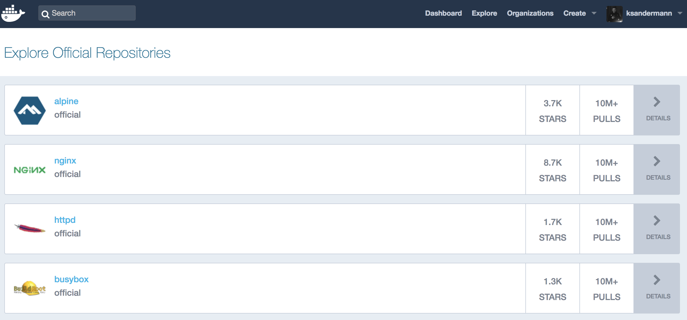
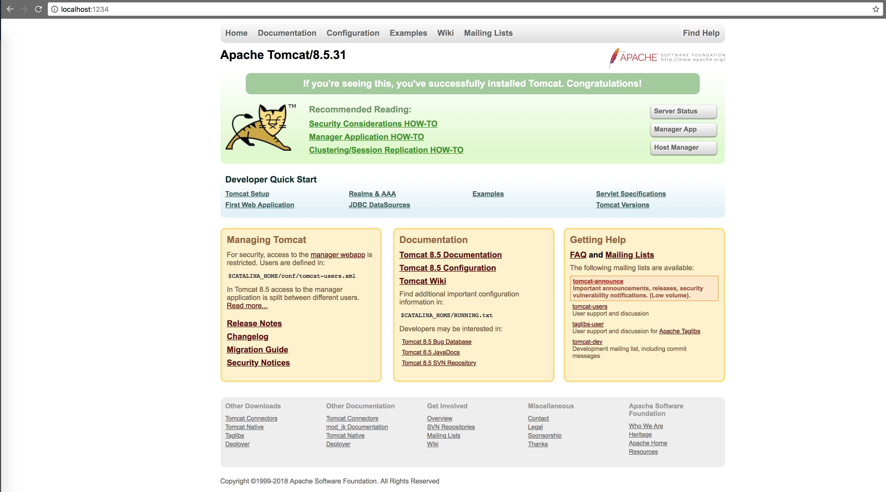

# BAY - DevOps : 02 Containerization with Docker - Basics

This exercise aims to show you the basic concepts of containers using
Docker.

## What is Docker?

Docker is the world's leading
containerization platform, allowing to build and run containers on linux
systems. Containers are lightweight, stand-alone and isolated virtual environments which look like virtual servers, but are not virtual machines. Containers are based on operating system-level virtualization implemented on kernel features such as namespaces and cgroups.

There is also a native version of docker for windows, but images are not compatible between both. There are other container platforms beside docker, such as BSD Jails, Solaris Zones or OpenVZ, but docker is the most popular one.

## What are the Benefits?

Using Containers and/or Docker has several benefits:

- **Standardization, Compatibility & Portability:** Containers
  ensure consistency between multiple environments. You can easily
  manage repeatable development, build, test, and production
  environments. No matter which environment you’re working in, they
  all behave like the real production environment - even your
  laptop. No more "but it works on my machine".
- **Continuous integration and deployment:** Container platforms such
  as Docker integrate nicely with tools like Jenkins and can help with
  automating tests (on all environments) and trigger automatic
  deployments upon successful tests.
- **Rapid deployment:** Deployments are much faster by using
  Containers, due to the fact that there is no OS that needs to be
  booted (in contrast to virtual machines).
- **Isolation and Security:** Applications that are running on
  containers are completely segregated and isolated, meaning that
  processes that are running inside a container cannot see or affect
  processes running in another container or on the host system.
- **Efficiency:** Containers run with native execution speed of the
  host system, as there is no performance impact of hypervisors used
  in classic virtualization.
- **Return on Investment:** Containers are great for drastically
  reducing the infrastructure resources and can therefore save on
  everything from server costs to the employees needed to maintain
  them. For more information on that topic, be sure to check out
  the <a href="https://www.docker.com/roicalculator" class="external-link">Docker ROI calculator</a>.

All these features fit nicely with recent IT trends such as DevOps or
Microservices. While it is possible to implement Microservices with
classic virtualiziation, it is much more efficient to do that with
containers. This is one of the reasons while Docker is so popular now.

## Who is Docker?

Docker was introduced in 2013 by a company named dotCloud, which renamed
itself to Docker Inc. Docker Inc. is located in San Francisco,
California and is a nice example of a so called "unicorn" startup
company, meaning that it is valued 1 billion \$ or more. There are
actually two versions of docker, the Open Source Docker CE (Community
Edition) and a commercial Docker EE (Enterprise Edition). The Docker CE
version has an Apache License and can be used commercially. The Docker
EE version offers support, a different release cycle and additional
features such as role based access control or recently also builtin
Kubernetes.

Docker is very successful because they focused on development and
testing while other container platforms focused on systems operation.
This together with the recent IT trends of Microservices and that docker
is very well designed and easy to use let to its huge success.

## What is in Docker?

Docker consists of the following main parts:

- The **Docker Container Runtime** which executes the containers. This
  is the docker daemon, but we could also say that the kernel is the
  container runtime.
- The **docker** command line interface, used to build docker images
  or control container execution.
- The **Docker Hub**, which is a docker image repository. It has a web
  interface to browser available **Docker Images**. It includes a
  docker registry which provides a technical interface to load (pull)
  or upload (push) docker images.

Beside that, there is a tool called docker-compose which allows to
construct applications from multiple docker images.

## Lets get our feet wet!

You can get the latest version of Docker for your
OS <a href="https://www.docker.com/get-docker" class="external-link">here</a>.

## Running a container locally

In order to run your first docker container locally, open a shell and
test your installation of docker by running `docker version`:

```bash
docker version
```

If docker is installed properly, you will see a response similar to the
one shown below:

```bash
Client:
 Version:      18.03.1-ce
 API version:  1.37
 Go version:   go1.9.5
 Git commit:   9ee9f40
 Built:        Thu Apr 26 07:17:20 2018
 OS/Arch:      linux/amd64
 Experimental: false
 Orchestrator: swarm

Server:
 Engine:
  Version:      18.03.1-ce
  API version:  1.37 (minimum version 1.12)
  Go version:   go1.9.5
  Git commit:   9ee9f40
  Built:        Thu Apr 26 07:15:30 2018
  OS/Arch:      linux/amd64
  Experimental: false
```

Enough of the prerequisites - now
off to the fun part - let's run a first container!

In order to run a docker container, we will always use the command *`docker run image-name:image-tag`.*

Let's try it by running the command `docker run hello-world`.

```bash
docker run hello-world
```

You should see a similar output to the one below:

```bash
Unable to find image 'hello-world:latest' locally
latest: Pulling from library/hello-world
9bb5a5d4561a: Pull complete
Digest: sha256:3e1764d0f546ceac4565547df2ac4907fe46f007ea229fd7ef2718514bcec35d
Status: Downloaded newer image for hello-world:latest

Hello from Docker!
This message shows that your installation appears to be working correctly.

To generate this message, Docker took the following steps:
 1. The Docker client contacted the Docker daemon.
 2. The Docker daemon pulled the "hello-world" image from the Docker Hub.
    (amd64)
 3. The Docker daemon created a new container from that image which runs the
    executable that produces the output you are currently reading.
 4. The Docker daemon streamed that output to the Docker client, which sent it to your terminal.

To try something more ambitious, you can run an Ubuntu container with:
 $ docker run -it ubuntu bash

Share images, automate workflows, and more with a free Docker ID:
 https://hub.docker.com/

For more examples and ideas, visit:
 https://docs.docker.com/engine/userguide/
```

Wow - that was quick, wasn't it?

If you read the message you get from the docker client, you understand
what actually happened in the background. We will come back to the more
ambitious part later on, let's focus on the idea of free docker images
for now.

A popular idea in DevOps and the docker community is releasing your
images as open-source in order for others to benefit from your ideas as well. That's
what happened before - we used the *hello-world* image from dockerhub -
but what's dockerhub, anyways?

## Exploring open-source Images

There are tons of opensource docker images available for usage. The most
popular open repository for docker images is dockerhub.

Feel free to head over
to <a href="https://hub.docker.com/explore/" class="external-link">dockerhub</a> to
explore which images are available:



There are thousands and thousands of open source images available for
usage.

To run an open image from dockerhub, simply choose the image and use
the `docker run` command as before. If we would like to use the busybox
image for example, we would use the following command:

```bash
docker run busybox:latest
```

What the docker client will actually do once you run this command is:

1. Check for the "_busybox_" image with the correct tag locally.
2. If it wasn't found on your machine, docker will search in the
   repository you are currently logged into (which by default, is
   dockerhub).
3. If the image was found, the specific tag for the image will be
   pulled from the repository to your local machine. In specific, only
   the changes to the latest tag you may have on your local machine
   will be downloaded. I.e., if you have a *busy-box:0.1* locally and
   want to run *busy-box:0.2*, only the changes (so-called image
   layers) will be downloaded - pretty cool, isn't it?
4. The pulled image will be executed using the run command with the
   given parameters.

Of course, there are more possibilities than running images from your
local machine and from dockerhub. You can login to any docker
repository, for example a Nexus repository, the docker repository that's inside OpenShift or an Artifactory running inside docker on your local machine itself.

Let's explore the `docker run` command a bit further, as it is important
in order to understand how to actually use docker productively.

Be careful about which images you run, as it is another form of
downloading software from the internet and running it.

> **NOTE**:
> Before running a docker image I usually check the following criterias
>
> - It is an official image coming from a trustable source such as the
>   maintainers of the underlying software package?
> - Is the required license acceptable?
> - Is the image well maintained?
> - Are the sources linked?

The first 3 criterias are a must, the linked sources rather a should.

## Running images with advanced settings

In the chapter above, we used the *`docker run`* command to run a first
version of a docker container. Now, let's actually run a container that
will keep running in the background that we can interact with.

## Binding ports to your local machine

A very common practice when running docker containers is to map ports
from you local machine (localhost) to ports inside the docker container.

You can then for example access a web server running inside the
container on port 8080 by calling localhost:8080 (assuming that you
bound port 8080 to port 8080).

You can bind ports by using the option *-p hostport:containerport*,
e.g. `docker run -p 8080:8080 imagename`.

_Note that you must specify the options after the docker command, e.g.
"`run`" and before the image name, otherwise these would be passed as
arguments to the started image and not to docker itself.  
_

**Exercise**: Try to run the
latest *tomcat* image from dockerhub on your machine and call the tomcat
from your browser. Add the option `-d` to detach the container and let
it run in the background.

??? note "Solution - only open once finished :)"
      Run the image with bound ports:

      ```bash
      docker run -d -p 8080:8080 tomcat
      ```

      Open the welcome page in your browser on `localhost:8080`:

      

## Running an interactive shell

Another useful parameter when running docker container is to open an
interactive shell inside the docker container you are running.

The terminal session that you are using to execute `docker run` will
then jump into a shell session inside the docker container you are
running. Let's try it by adding the `-it` parameter:

```bash
docker run -it ubuntu bash
```

If you run the *`ls`* command inside the shell that opened, you should
see the directories that can be found at the root of ubuntu:

```bash
root@a8548239e621:/# ls
bin  boot  dev  etc  home  lib  lib64  media  mnt  opt  proc  root  run  sbin  srv  sys  tmp  usr  var
```

What happened here:

- We used the `-it` parameter to tell docker to run in an interactive
  mode which allows to jump into a shell session inside the container
- We specified an open source image from dockerhub as we did
  previously, in this case the latest *ubuntu* image (not specifying a
  tag will result in the docker client to use the *latest* tag)
- We added `bash` to the end of the command, which will specify the
  entrypoint with which the docker client will jump into the
  container. In this case, the binary *bash* will be run, which opens
  a bash terminal inside the container we will then jump into.
- As we can see in the later part of the screenshot, we jumped into
  the container *a8548239e621* as user *root*, where we
  executed `ls`(which lists the contents of the current directory) in
  order to test the session.

- How easy was that?
- You can always exit the shell again by typing `exit`

**Exercise**: Try it out yourself -
Search for your favorite OS on dockerhub and try to run an interactive
shell inside the OS!

Afterwards, let's think of the use-cases for this command:

You do not need to install any CLI-tooling (openshift cli, kubectl,
ansible, bash, basically everything)  on your local machine anymore -
you can run all the tooling inside docker containers with specific
versions, no need for installation of any tooling locally anymore!

## Mounting directories

Another important parameter for *`docker run`* is to mount files and
directories into the container.

A common use-case i.e. is to mount the current directory or the .ssh
directory into the container in order to be able to use the ssh-settings
of your host system or to run i.e. scripts from your local system inside
a docker container.

Mounting directories into a container is as easy as binding ports into
the container, the needed parameter
is `-v host-directory:container-directory`

Note that the host-directory must be an absolute path if you want to
explicitly mount a local directory. This is called a "bind mount".
Otherwise docker would create an internal directory and mount that.

**Exercise:** Try to mount a specific directory into a container and execute a local shell inside it to
navigate into the directory and list the mounted files to verify that it worked.

??? note "Solution - only open once finished :)"
      
      ```bash
      docker run -it -v $HOME/.ssh:/root/ssh ubuntu bash
      ```

      If you navigate into the directory you just mounted, you can display the content of it by executing the command `ls`.

## Managing running containers

You may have already asked yourself what happens to all the containers
we executed - will they run forever and use resources on my system?

It depends, they might. A docker container always runs as long as the process that runs inside of it. In case of the `hello-world` container, it ran as long as it took for it to output the text. A Docker container with a web server for example will run forever, since the web server should not stop automatically. But don't worry, you can stop those containers, they just don't do it theirselves.

In order to examine which containers are currently running on your
system, we use the command *`docker ps`*.

If you successfully executed the exercises above, your output should
show the following:

```bash
CONTAINER ID        IMAGE               COMMAND             CREATED              STATUS              PORTS                    NAMES
4206414cb498        tomcat              "catalina.sh run"   20 minutes ago   Up About a minute   0.0.0.0:1234->8080/tcp   vigilant_poincare
```

As we can see, only the tomcat image we ran before was supposed to run
in the background and not to shut itself down and is therefore still
running.

In order to stop the image, you can use the `docker stop` command
followed by the *CONTAINER ID* you want to stop:

```bash
docker stop 4206414cb498
```

You can verify that your container stopped by
running *`docker ps`* again.

## Next step

After running several open source docker images, you may ask yourself
how to build your own images. Don't worry, that's exactly what we are
gonna do in the next exercise.
