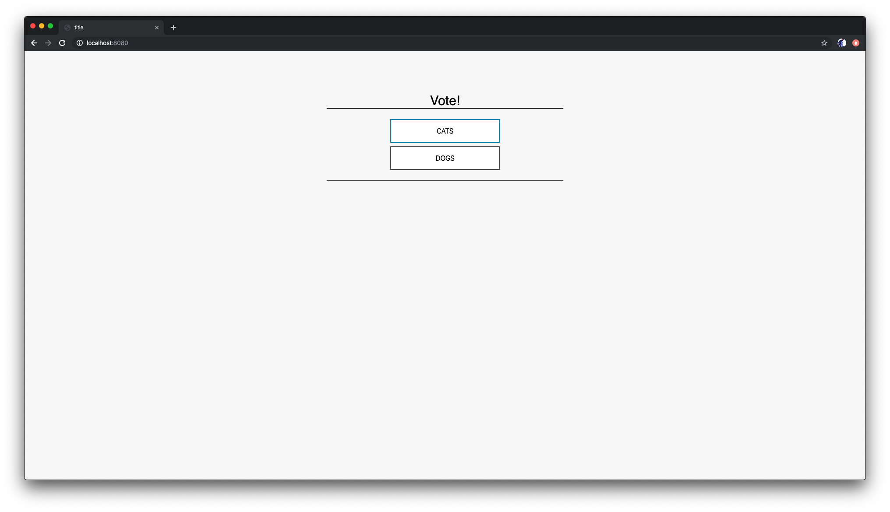

# 03 Containerization with Docker - Building Docker images

## Dockerfiles

Using open-source Docker images is cool, but you quickly run into cases
where you want to do some customizations to these images. That's where
Dockerfiles come into play. The goal of this exercise is to get an
understanding of how Dockerfiles are built and what they do.

A very good tutorial on how dockerfiles are structued and can be used
can be found on [Romin Arini's blog](https://rominirani.com/), a blogger who's "passion is to help developers succeed". If you want to take a deeper look at how to build Docker images, you can find the tutorial [here](https://rominirani.com/docker-tutorial-series-writing-a-dockerfile-ce5746617cd).

## Writing a Dockerfile

In this part, we shall take a look at how to build our own Docker images
via a Dockerfile. Writing a Dockerfile is a consistent and repeatable
way to build your own images.

A Dockerfile is a text file that has a series of instructions on how to
build your image. It supports a simple set of commands that you need to
use in your Dockerfile. Dockerfiles can be versioned, since they are just textual files. This allows you to perform rollbacks if component upgrades fail, for example.

There are several commands supported like FROM, CMD, ENTRYPOINT, VOLUME, ENV and more. We shall look at some of them. Let us first start with the the overall flow, which goes something like this:

1. You **create a Dockerfile** with the required instructions.
2. Then you will **use the docker build command** to create a Docker
   image based on the Dockerfile that you created in step 1.

With this information, let us get going.

First up, launch a terminal and create a folder named images and
navigate into it, as shown below. This will be our root folder where we
will create our Dockerfile.

```bash
cd ~/devops-training
mkdir images
cd images
```

Now create your first Dockerfile (which will also be
named *Dockerfile*). You can create a file called *Dockerfile* with the command below (or use the folder view in the left menu, right-click and choose `New file`):

```bash
touch Dockerfile
```

You can open the file called `Dockerfile` in the editor from the folder structure on the left side. If you can't see a folder called `images`, right-click and choose `Refresh`.
The content of your Dockerfile should be the following:

```bash
FROM busybox:latest
MAINTAINER Tobias Geiselmann (tobias.geiselmann@senacor.com)
```

Since, a Docker image is nothing but a series of layers built on top of
each other, we start with a base image.
The [FROM](https://docs.docker.com/reference/builder/#from) command
sets the base image for the rest of the instructions. The MAINTAINER
command tells who is the author of the generated images. You can insert
your own name and email address here. This is a good practice. You could
have taken any other base image in the FROM instruction too, for e.g.
ubuntu:latest or ubuntu:14.04, etc.

Now, save the file and come back to the prompt.

Execute the following in the **/images** folder as shown below:

```bash
docker build -t myimage:latest .
```

If you named your Dockerfile other than `Dockerfile`, you need to explicitely provide the name with the `-f` parameter.

```bash
docker build -t myimage:latest -f <your_Dockerfile> .
```

What we have done here is the step 2 that we highlighted in the overall
process above i.e. we have executed the docker build command. This
command is used to build a Docker image. The parameters that we have
passed are:

- -t is the Docker image tag. You can give a name to your image and a
  tag.
- The second parameter (a ‘.’) specifies the location of the
  Dockerfile that we created. Since we created the Dockerfile in the
  same folder in which we are running the docker build, we specified
  the current directory.

The output on your console will look similar to this:

```bash
 Sending build context to Docker daemon 2.048 kB
 Sending build context to Docker daemon
 Step 0 : FROM busybox:latest
 ---> 8c2e06607696
 Step 1 : MAINTAINER Romin Irani (email@domain.com)
 ---> Running in 5d70f02a83e1
 ---> 3bc3545a1f64
 Removing intermediate container 5d70f02a83e1
 Successfully built 3bc3545a1f64
```

Notice the various steps that the build process goes through to build
out your image.

If you run a *`docker images`* command now, you will see the myimage
image listed in the output as shown below:

```bash
docker images
```

You should get an output like this:

```bash
REPOSITORY TAG    IMAGE ID     CREATED       VIRTUAL SIZE
myimage    latest 3bc3545a1f64 3 minutes ago 2.433 MB
```

You can now launch a container, any time via the standard docker run
command:

```bash
docker run -it myimage
```

And we are back into the **myimage** shell.

Now, let us modify the Dockerfile with a new
instruction [CMD](https://docs.docker.com/reference/builder/#cmd) as
shown below:

```bash
FROM busybox:latest
MAINTAINER Tobias Geiselmann (tobias.geiselmann@senacor.com)
CMD ["date"]
```

Now, build the image and run a container based on it again. You will
find that it printed out the date for you as shown below:

```bash
Thu Jul 02 11:14:42 UTC 2017
```

The CMD instruction takes various forms and when it is used individually
in the file without the ENTRYPOINT command (which we will see in a
while), it takes the following format:

```bash
CMD ["executable","param1","param2"]
```

So in our case, we provided the date command as the executable and when
we ran a container based on the *myimage* now, it printed out the data.

In fact, while launching the container, you can override the default CMD
by providing it at the command line as shown below. In this example, we
are saying to launch the shell , thereby overriding the default CMD
instruction for the Docker Image. Notice that it will lead us into the
shell.

```bash
docker run -it myimage /bin/sh
```

**Exercise**: Try out modifying the CMD instruction. Give some other
commands like CMD \[“ls”,”-al”\] , build the image and run a container
based on that. The best practice is to use another
command [ENTRYPOINT](https://docs.docker.com/reference/builder/#entrypoint) together
with CMD. The ENTRYPOINT is used to specify the default app that you
want to run (This is the way to configure a container that will run as
an executable.) The CMD will then provide only the list of parameters to
that ENTRYPOINT application. You could still override the CMD parameters
at the command line while launching the container. Let us understand
that with the following example.

Change your Dockerfile to the following:

```bash
FROM busybox
MAINTAINER Tobias Geiselmann (tobias.geiselmann@senacor.com)
ENTRYPOINT ["/bin/cat"]
CMD ["/etc/passwd"]
```

Now when you build the image and run a container as follows:

```bash
docker run -it myimage
```

It will give you an output similar to this:

```bash
 root:x:0:0:root:/root:/bin/sh
 daemon:x:1:1:daemon:/usr/sbin:/bin/sh
 bin:x:2:2:bin:/bin:/bin/sh
 sys:x:3:3:sys:/dev:/bin/sh
 sync:x:4:100:sync:/bin:/bin/sync
 mail:x:8:8:mail:/var/spool/mail:/bin/sh
 proxy:x:13:13:proxy:/bin:/bin/sh
 www-data:x:33:33:www-data:/var/www:/bin/sh
 backup:x:34:34:backup:/var/backups:/bin/sh
 operator:x:37:37:Operator:/var:/bin/sh
 haldaemon:x:68:68:hald:/:/bin/sh
 dbus:x:81:81:dbus:/var/run/dbus:/bin/sh
 ftp:x:83:83:ftp:/home/ftp:/bin/sh
 nobody:x:99:99:nobody:/home:/bin/sh
 sshd:x:103:99:Operator:/var:/bin/sh
 default:x:1000:1000:Default non-root user:/home/default:/bin/sh
```

So, what happened was it took the default ENTRYPOINT i.e. cat command
and used the parameters that the CMD provided to run the command.

Try to override the CMD by running the container with a non-existent
file name:

```bash
docker run -it myimage somefile.txt
```

Now you will get the following output:

```bash
cat: can't open 'somefile.txt': No such file or directory
```

You get the point?

## Containerizing our application

Let's get back to our application and build a Docker image for it.

```bash
cd ~/devops-training/devops-training-application/app
touch Dockerfile
```

Open the newly created Dockerfile in the IDE editor. Remember that it was a Node.js application? Now can you guess which base image we are going to build it upon?

Correct, you can find the official Node.js Docker image on [Dockerhub](https://hub.docker.com/_/node). So our Dockerfile will start with this:

```docker
FROM node:12.1-alpine
```

Next, we are going to set our working directory with the `WORKDIR` command and an absolute path, as this is best practice and more reliable than using `cd` to navigate to some folders.

```docker
WORKDIR /usr/src/app
```

Next, we need to copy the file `package.json` into our container, as it contains a list of all dependencies for our application. The command `npm install` is used to download all these dependencies into a folder and make them accessible to our application.

```docker
COPY package.json ./
RUN npm install
```

Great, now we have all dependencies ready for our application. If you paid attention what we've done so far, you will notice that we forgot something - our source code. So let's copy that into our container, too.

```docker
COPY api.js index.js server.js ./
COPY public ./public
```

We want to expose the container port 8080, so that our container can receive traffic on that port. Docker provides an `EXPOSE` command for that and it's as simple as that:

```docker
EXPOSE 8080
```

Finally, wen need to start our container with the command `npm start`, but you already know how to execute a command, don't you? Feel free to finish the Dockerfile yourself and check if it matches the one below.

??? note "Final Dockerfile"
    **_devops-training-application/app/Dockerfile:_**

    ```docker
    FROM node:12.1-alpine

    WORKDIR /usr/src/app

    COPY package.json ./
    RUN npm install

    COPY api.js index.js server.js ./
    COPY public ./public

    EXPOSE 8080
    CMD [ "npm", "start" ]
    ```

Great, now let's build our image:

```bash
docker build -t frontend .
```

And we can run it in interactive mode to see the outputs:

```bash
docker run -it -p 8080:8080 frontend
```

You will see the following output with some errors that you might have noticed before:

```bash
Error: Redis connection to localhost:6379 failed - connect ECONNREFUSED 127.0.0.1:6379
    at TCPConnectWrap.afterConnect [as oncomplete] (net.js:1054:14) {
  errno: 'ECONNREFUSED',
  code: 'ECONNREFUSED',
  syscall: 'connect',
  address: '127.0.0.1',
  port: 6379
}
```

Remeber that we said that our database is built on Redis? Well, so far we did not run that database, that's why our application will complain. But we can run Redis in a Docker container, too. Docker provides a great mechanism called `docker-compose` which allows you to run multiple containers at the same time. Take a look at the file `docker-compose.yaml` in the root directory:

**_devops-training-application/docker-compose.yaml_**

```yaml
version: '3.2'
services:
  redis:
    image: redis
    ports:
      - 6379:6379

  frontend:
    build: ./app
    image: frontend
    ports:
      - 8080:8080
    environment:
      - SERVER_PORT=8080
      - REDIS_SERVER=redis
      - REDIS_PORT=6379
      - VOTE_VALUE_1=CATS
      - VOTE_VALUE_2=DOGS
    depends_on:
      - redis
```

We specified two services here:

- `redis` - our in-memory database where we will store our voting scores
- `frontend` - the Node.js application that we've just dockerized

Docker will look for a local image called `redis`, but since we've not built one, it will take the official Redis image from Dockerhub and run it. This will allow our Node.js application to talk to Redis on port 6379 and store its data there. You can build and run docker-compose files with the following command:

```bash
cd ~/devops-training/devops-training-application
docker-compose build
docker-compose up
```

Now we can take a look at our application. Open `localhost:8080` in your browser:



Try to click the buttons, it will work now! You can stop the application by pressing `ctrl+c` inside the terminal window.
