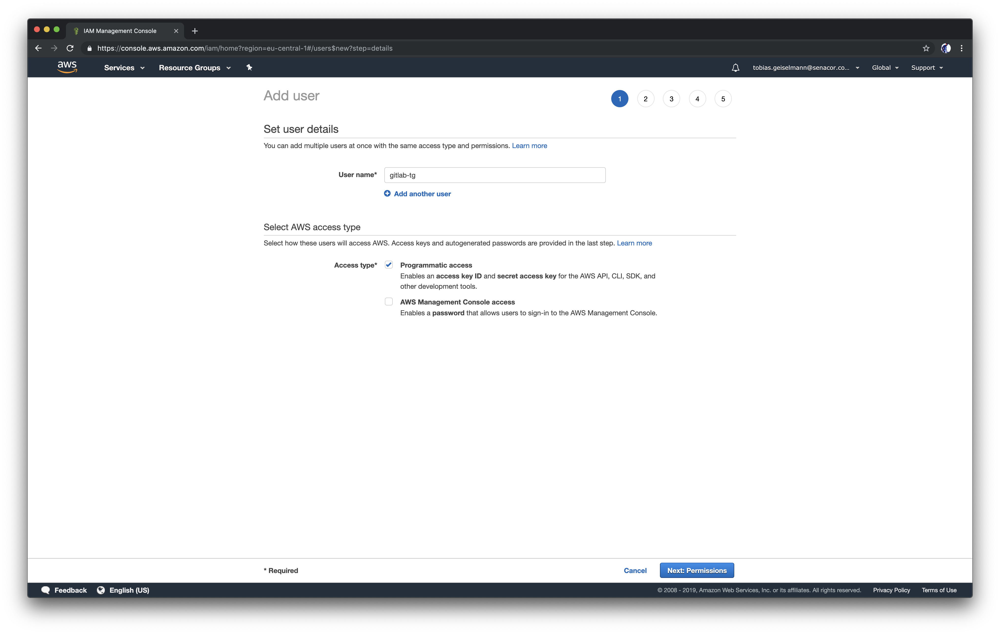
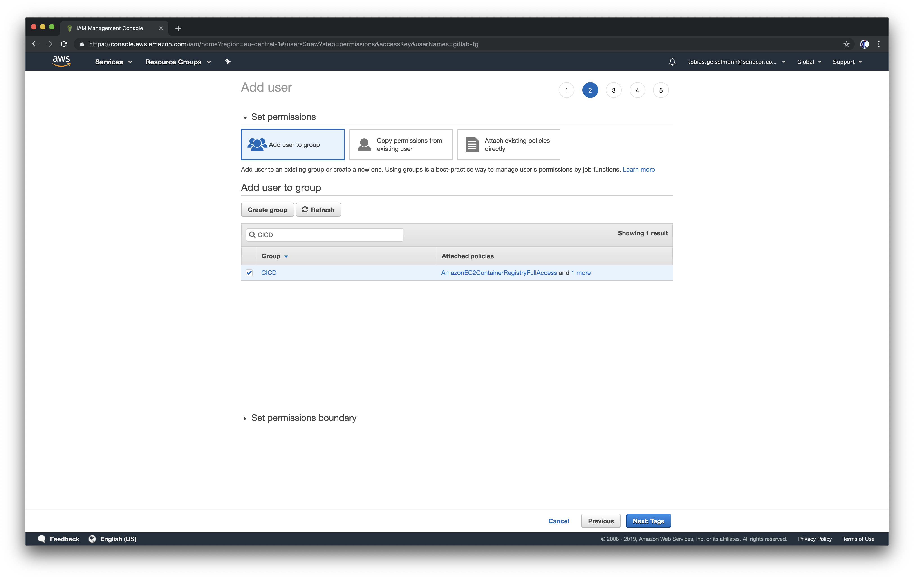
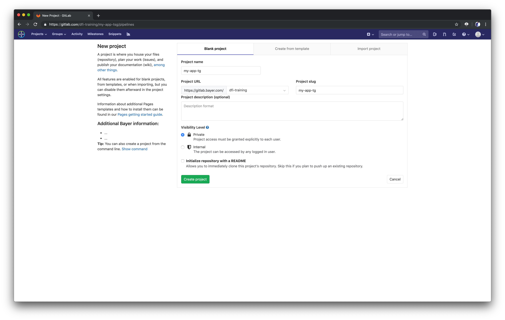
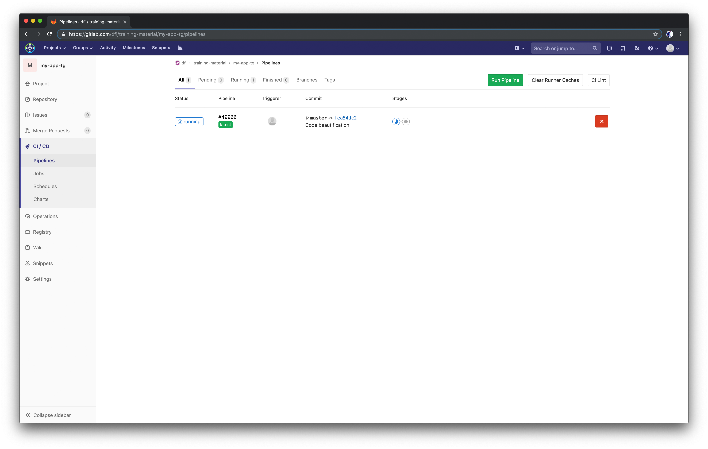

# Building a simple CI/CD pipeline

Now that we know how to build our Docker image manually on our local machine, let's get deeper into the idea of DevOps and build a central part of it: a CI/CD pipeline.

## Creating an ECR repository

Remember the output of docker images? That was the command that listed all images in your local docker registry. If we are going to build Docker images in a CI/CD pipeline, we are going to need a Docker registry in the cloud, where we can store our images. We could store our images on Dockerhub, but maybe you don't want to host all images of your company applications in a public registry. Luckily, AWS  provides a container registry service, called Elastic Container Registry (ECR). Let's create an ECR repository for our Docker image:

```bash
aws ecr create-repository --region eu-central-1 --repository-name frontend-<your-initials>
```

Output:

```bash
{
  "repository": {
    "repositoryArn": "arn:aws:ecr:eu-central-1:604370441254:repository/frontend-tg",
    "registryId": "604370441254",
    "repositoryName": "frontend-tg",
    "repositoryUri": "604370441254.dkr.ecr.eu-central-1.amazonaws.com/frontend-tg",
    "createdAt": 1558335434.0
  }
}
```

Save the `repositoryUri` for later, we are going to need that in a bit.

Now that we created an ECR repository, we need to configure our Gitlab pipeline to be able to access it. Switch to the IAM page on the AWS console and choose Users from the left-side menu. Then click Add User.  Create a user called `gitlab-<your-initials>` and enable programmatic access. Next, add it to the group called `CICD`. This group has two policies attached to it that enables it to access the ECR registry.




After you've created the IAM user, you will get an `Access key ID` and a `Secret access key`. We are going to store them as secrets for our Gitlab pipeline. Don't close that screen, otherwise you will need to generate new credentials.

Go to the Gitlab, login with your account and hit `New project`. This is the place where our code will be stored. Give the project a name with your initials in it (e.g. `my-app-<your-initials>`). When Gitlab asks if you want to initialize your project with a README, DON'T do that. We will fill our repository in a second.



When you've created your project, choose `Settings > CI/CD` from the left-side menu. Expand the `Variables` tab and create the following two variables with the AWS credentials that you just generated for your IAM user:

- `AWS_ACCESS_KEY_ID`: `<your acess key ID>`
- `AWS_SECRET_ACCESS_KEY`: `<our secret access key>`

Mark the variables as `Masked`.

Expand the `Runners` tab and click the `Enable shared runners` button. This will configure on which machine Gitlab will execute the pipeline steps. If you build a production pipeline, you might want to configure your own Runners and not use shared ones, e.g. by creating your own Runner based on an EC2 instance. But for the purpose of this training, shared Runners will work perfectly fine. These shared Runners are some machines that were already configured to be used by Gitlab by someone else.

Now we are going to define our pipeline. Gitlab pipelines are defined in a file named `.gitlab-ci.yml`. The structure of the file is already contained in your cloned project, but as of now it doesn't build anything. If you don't see the file, click the little cog icon in the file explorer and choose `Show Hidden Files`.

**_devops-training-application/.gitlab-ci.yml:_**

```yaml
image: docker:latest

variables:
  DOCKER_TLS_CERTDIR: ''
  REGION: eu-central-1
  REPOSITORY_URL: <insert your ECR repositoryUri>

services:
  - docker:dind

before_script:
  - apk add --no-cache curl jq python py-pip gettext
  - pip install awscli

stages:
  - test
  - build
  - pull_push
  - deploy
  - smoke_test

test:
  stage: test
  image: node:12.1-alpine
  script:
    # TODO: execute the unit tests here
    - echo "No tests configured"
  except:
    - master

build:
  stage: build
  script:
    - $(aws ecr get-login --no-include-email --region $REGION)
    # TODO: implement docker build command
    # TODO: implement docker push command
  except:
    - master
```

The first block of the pipeline is used to define `variables` that are available in every pipeline step. We define our AWS region here and store the URI to our ECR repository that we created earlier. Fill in your `repositoryUri` there.

Currently we listed two stages for our pipeline, `test` and `build`. You can see that both stages have `TODO`s inside their `script` section, on which we will work now.

## Test step

The commands listed in the `script` section are essentially just shell commands. Remember how we executed the unit tests locally from our bash with `npm test`? We can use the very same command to run the tests in our pipeline. So, can you implement the test stage?

??? note "Tips" 
    - Just running `npm test` won't be enough. You need to make sure that you are in the correct directory and that npm has all of it's dependencies. 
    - You can install the dependencies with `npm install`.

??? note "Solution"
    ```yaml 
    test: 
      stage: test 
      image: node:12.1-alpine 
      script: 
        - cd ./app && npm install && npm test 
      except: 
        - master
    ```

## Build step

You will find two more TODOs in the build stage. Try to figure them out on your own. You can find a few tips below and the solution below.

??? note "Tips" 
    
    - Try to figure out a way to give your Docker images a unique tag.
    - Gitlab provides a few predefined environment variables which are useful for tagging your Docker image. You can find them [here](https://gitlab.com/help/ci/variables/predefined_variables.md).

    - You should tag your Docker image with the repository URL and the tag that you chose, it should look like this: `$REPOSITORY_URL:<your_tag>`

    - You are going to need two docker push commands, one for the unique tag and one for the latest tag.

    - The `docker push` command looks this: `docker push $REPOSITORY_URL:<your_tag>`

??? note "Solution"
    ```yaml 
    build: 
      stage: build 
      script: 
        - $(aws ecr get-login --no-include-email --region eu-central-1) 
        - docker build -t $REPOSITORY_URL:$CI_COMMIT_SHORT_SHA -t $REPOSITORY_URL:latest ./app 
        - docker push $REPOSITORY_URL:$CI_COMMIT_SHORT_SHA 
        - docker push $REPOSITORY_URL:latest 
      except: 
        - master
    ```

We are using a predefined environment variable called `$CI_COMMIT_SHORT_SHA` to tag our images, which returns the first 8 characters of the commit revision, something like `41fa7e08`. Additionally, we are tagging the image as latest and then we push both image tags. That way we have a history of our images that corresponds to our commit IDs and we know which one is the latest image.

## Push our code

Now we only need to commit our code to the newly created Gitlab project to trigger the pipeline. Since you cloned the code from an existing repository, we need to change the remote URL. You will find your URL when you click the `Clone` button in your newly created project on the Gitlab pahge, it will look something like `https://gitlab.com/<your-username>/my-app-<your-initials>.git`. Ecexute the following command to change the remote URL, push your code and create a feature branch:

```bash
cd ~/devops-training/devops-training-application
git remote set-url origin <your-Gitlab-URL>
git add .
git commit -m "Created my first pipeline"
git push
git checkout -b feature-first-deployment
git push --set-upstream origin feature-first-deployment
```

When git asks you for authentication credentials, use your Gitlab email address as username and the personal access token we created earlier as password.

Switch to your project in the Gitlab Web UI and choose CI/CD from the left-side menu. There you will see that your pipeline is running:



You can check if your push was successful by running the following command (with only your repository name, not the full repositoryUri):

```bash
aws ecr list-images --region eu-central-1 --repository-name <your-ecr-repository>
```

The output looks something like this:

```json
{
  "imageIds": [
    {
      "imageDigest": "sha256:bc3139f84e3f6ffa73e961591ec5897d92cd5c4a96797ba564c49c21059a7d9f",
      "imageTag": "latest"
    },
    {
      "imageDigest": "sha256:bc3139f84e3f6ffa73e961591ec5897d92cd5c4a96797ba564c49c21059a7d9f",
      "imageTag": "41fa7e08"
    }
  ]
}
```

Awesome, we have a CI/CD pipeline that tests and builds our images and stores them in an ECR repository. But now we actually want to run our application in the cloud. And that's exactly what we are going to do in the next section.
