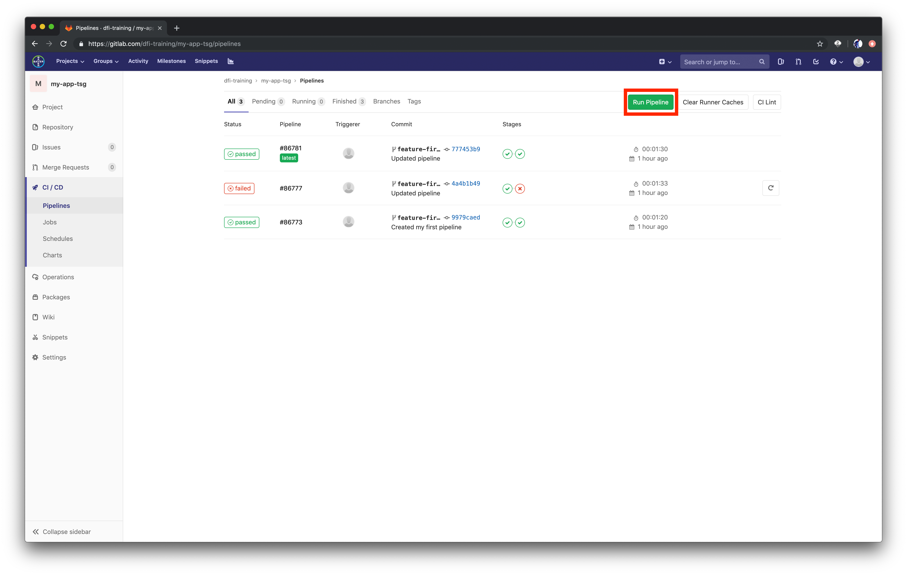

# Introduction to Terraform

Terraform is a tool for building, changing and managing infrastructure. The components that shall be provisioned as your infrastructure are described in configuration files. Terraform generates and executes an execution plan that describes the order of actions that need to be performed in order to reach the desired state described in the configuration files. When the configuration changes, Terraform is able to determine what changed and creates execution plans to reach a desired state again. The whole concept of Terraform is known as `Infrastructure as Code`. One great thing about Terraform is that it supports many cloud providers, including AWS.

## Why Infrastructure as Code?

Infrastructure as Code is great, because it can be treated as every other piece of code. You can version it by putting it into a version control system (e.g. Gitlab), you can test it and you can share and re-use it.

## Basic examples

Let's look at a few basic examples to see how Terraform works. Check if terraform works correctly by running:

```bash
terraform version
```

Output:

```bash
Terraform v0.12.7
```

So let's provision a simple EC2 instance (a virtual machine on AWS) by writing a configuration file. Create a new folder called `terraform-demo` and create a file called `main.tf` inside it:

```bash
cd ~/devops-training
mkdir terraform-demo
cd terraform-demo
touch main.tf
```

Open the file `main.tf` in your IDE and copy the following configuration into it:

```json
provider "aws" {
  region     = "eu-central-1"
}

resource "aws_instance" "example" {
  ami           = "ami-00aa4671cbf840d82"
  instance_type = "t2.micro"
}
```

The provider block is used to configure the named provider, in our case `aws`. A provider is responsible for creating and managing resources.

The resource block defines a resource that exists within the infrastructure. In our case, the resource is an `aws_instance`, which is also known as an EC2 instance.

The first command that you need to run if you have a new configuration is:

```bash
terraform init
```

Terraform uses plugins to support multiple providers and the command above will download all plugins that you need to provision the infrastructure that you described.

As the output from `terraform init` suggests, we can now run `terraform plan`, to see all the changes that will be necessary to create our infrastructure:

```bash
terraform plan
```

Output:

```bash
An execution plan has been generated and is shown below.
Resource actions are indicated with the following symbols:
  + create

Terraform will perform the following actions:

  # aws_instance.example will be created
  + resource "aws_instance" "example" {
      + ami                          = "ami-00aa4671cbf840d82"
      + arn                          = (known after apply)
      + associate_public_ip_address  = (known after apply)
      + availability_zone            = (known after apply)
      + cpu_core_count               = (known after apply)
      + cpu_threads_per_core         = (known after apply)
      + get_password_data            = false
      + host_id                      = (known after apply)
      + id                           = (known after apply)
      + instance_state               = (known after apply)
      + instance_type                = "t2.micro"
      + ipv6_address_count           = (known after apply)
      + ipv6_addresses               = (known after apply)
      + key_name                     = (known after apply)
      + network_interface_id         = (known after apply)
      + password_data                = (known after apply)
      + placement_group              = (known after apply)
      + primary_network_interface_id = (known after apply)
      + private_dns                  = (known after apply)
      + private_ip                   = (known after apply)
      + public_dns                   = (known after apply)
      + public_ip                    = (known after apply)
      + security_groups              = (known after apply)
      + source_dest_check            = true
      + subnet_id                    = (known after apply)
      + tenancy                      = (known after apply)
      + volume_tags                  = (known after apply)
      + vpc_security_group_ids       = (known after apply)

      + ebs_block_device {
          + delete_on_termination = (known after apply)
          + device_name           = (known after apply)
          + encrypted             = (known after apply)
          + iops                  = (known after apply)
          + kms_key_id            = (known after apply)
          + snapshot_id           = (known after apply)
          + volume_id             = (known after apply)
          + volume_size           = (known after apply)
          + volume_type           = (known after apply)
        }

      + ephemeral_block_device {
          + device_name  = (known after apply)
          + no_device    = (known after apply)
          + virtual_name = (known after apply)
        }

      + network_interface {
          + delete_on_termination = (known after apply)
          + device_index          = (known after apply)
          + network_interface_id  = (known after apply)
        }

      + root_block_device {
          + delete_on_termination = (known after apply)
          + encrypted             = (known after apply)
          + iops                  = (known after apply)
          + kms_key_id            = (known after apply)
          + volume_id             = (known after apply)
          + volume_size           = (known after apply)
          + volume_type           = (known after apply)
        }
    }

Plan: 1 to add, 0 to change, 0 to destroy.
```

We see that Terraform will create one instance with instance_type `t2.micro` and the ami that we specified. Great, that's exactly what we wanted. So let's go ahead and let Terraform do it's work:

```bash
terraform apply
```

You will need to confirm this command by typing `yes`. After a little while, it should say that the apply is complete and 1 resource was created:

```bash
aws_instance.example: Creating...
aws_instance.example: Still creating... [10s elapsed]
aws_instance.example: Still creating... [20s elapsed]
aws_instance.example: Still creating... [30s elapsed]
aws_instance.example: Creation complete after 31s [id=i-0f44e3e1c8e0cf3ed]

Apply complete! Resources: 1 added, 0 changed, 0 destroyed.
```

Terraform stores the current state in a file called `terraform.tfstate`. You can run `terraform show` to inspect the current state:

Output:

```bash
# aws_instance.example:
resource "aws_instance" "example" {
    ami                          = "ami-00aa4671cbf840d82"
    arn                          = "arn:aws:ec2:eu-central-1:362403664804:instance/i-0f44e3e1c8e0cf3ed"
    associate_public_ip_address  = true
    availability_zone            = "eu-central-1b"
    cpu_core_count               = 1
    cpu_threads_per_core         = 1
    disable_api_termination      = false
    ebs_optimized                = false
    get_password_data            = false
    id                           = "i-0f44e3e1c8e0cf3ed"
    instance_state               = "running"
    instance_type                = "t2.micro"
    ipv6_address_count           = 0
    ipv6_addresses               = []
    monitoring                   = false
    primary_network_interface_id = "eni-084103e11baa63b9b"
    private_dns                  = "ip-172-31-40-173.eu-central-1.compute.internal"
    private_ip                   = "172.31.40.173"
    public_dns                   = "ec2-18-197-155-85.eu-central-1.compute.amazonaws.com"
    public_ip                    = "18.197.155.85"
    security_groups              = [
        "default",
    ]
    source_dest_check            = true
    subnet_id                    = "subnet-00cf3d4a3ea9d9cc9"
    tenancy                      = "default"
    volume_tags                  = {}
    vpc_security_group_ids       = [
        "sg-02ab296f8fc75bd9f",
    ]

    credit_specification {
        cpu_credits = "standard"
    }

    root_block_device {
        delete_on_termination = true
        encrypted             = false
        iops                  = 100
        volume_id             = "vol-0bb9d9090d28c23b7"
        volume_size           = 8
        volume_type           = "gp2"
    }
}
```

You can see all the information of your instance here, for example it's public IP. Let's see what happens when we change our configuration file. Let's tell Terraform to provision a `t2.small` instance instead of a `t2.micro` instance. Change the file `main.tf` in the following way:

```json
provider "aws" {
  region     = "eu-central-1"
}

resource "aws_instance" "example" {
  ami           = "ami-00aa4671cbf840d82"
  instance_type = "t2.small"
}
```

Then run `terraform plan` to see what changes Terraform will perform:

```bash
Plan: 0 to add, 1 to change, 0 to destroy.
```

In order to change the size of our instance, Terraform will take the instance that already exists and change it. Great, so let's do that:

```bash
terraform apply
```

Output:

```bash
aws_instance.example: Modifying... [id=i-0f44e3e1c8e0cf3ed]
aws_instance.example: Still modifying... [id=i-0f44e3e1c8e0cf3ed, 10s elapsed]
aws_instance.example: Still modifying... [id=i-0f44e3e1c8e0cf3ed, 20s elapsed]
aws_instance.example: Still modifying... [id=i-0f44e3e1c8e0cf3ed, 30s elapsed]
aws_instance.example: Still modifying... [id=i-0f44e3e1c8e0cf3ed, 40s elapsed]
aws_instance.example: Still modifying... [id=i-0f44e3e1c8e0cf3ed, 50s elapsed]
aws_instance.example: Modifications complete after 50s [id=i-0f44e3e1c8e0cf3ed]

Apply complete! Resources: 0 added, 1 changed, 0 destroyed.
```

You can run `terraform show` again, to see if the state actually changed. You can even double-check if everything worked as intended by using the AWS CLI. Copy the EC2 instance id from the output of `terraform show` and run the following to see the instance type:

```bash
aws ec2 describe-instance-attribute --region eu-central-1 --attribute instanceType --instance-id <your-instance-id>
```

The output should be the following:

```bash
{
    "InstanceId": "i-0f44e3e1c8e0cf3ed",
    "InstanceType": {
        "Value": "t2.small"
    }
}
```

Great, so we provisioned an EC2 instance. But what are we going to do with it? Well, actually nothing. So let's get rid of it again. Luckily, that's really easy since Terraform keeps track of all the infrastructure that we created in it's state file. Let's destroy the EC2 instance with the following command:

```bash
terraform destroy
```

Confirm with `yes`.

## Provisioning our ECR registry

For our EC2 instance, we provided attributes like `ami` and `instance_type`. You might ask yourself how you are supposed to know these attributes. That's where the documentation comes into play. Terraform provides a documentation for the provider AWS, where all these resources are documented, which you can find here: [Terraform AWS Provider](https://www.terraform.io/docs/providers/aws/index.html).

Remember the ECR repository that you created manually in the last exercise? Let's do that with a Terraform configuration, so we can manage it better. Let's first delete the ECR repository that we created earlier on:

```bash
aws ecr delete-repository --region eu-central-1 --force --repository-name <your-repository-name>
```

Now let's delete the EC2 instance from our configuration file and describe our ECR repository. Try to use the Terraform documentation for the AWS provider that is linked above to find the necessary information.

??? note "Hint"
    You can find the documentation for ECR repositories [here](https://www.terraform.io/docs/providers/aws/r/ecr_repository.html).

??? note "Solution"
    As you can see below, it's actually pretty simple. You just need to specify a resource `aws_ecr_repository` and give it a name. Make sure that the name is the same as the name of the repository that you just deleted.

**_terraform-demo/main.tf:_**

```json
provider "aws" {
  region     = "eu-central-1"
}

resource "aws_ecr_repository" "ecr" {
  name = "frontend-<your-initials>"
}
```

When you described your repository, you can go ahead and create it with `terraform apply`. Because we just deleted our repository before, we don't have any images anymore. But since we have our CI/CD pipeline, it's pretty easy to get our image back. Go to your project on the Gitlab page and choose `CI/CD > Pipelines` from the left-side menu. Then choose `Run pipeline`, choose your feature branch and click `Run pipeline` again on the next screen. Wait until the pipeline is finished and you should have an image in your ECR repository again.



Now that we've seen some simple Terraform configurations, let's move on and build something bigger with Terraform: a whole Kubernetes cluster!

PS: Don't worry, you won't have to write the whole configuration for the Kubernetes cluster with only the documentation. We've prepared that already.
