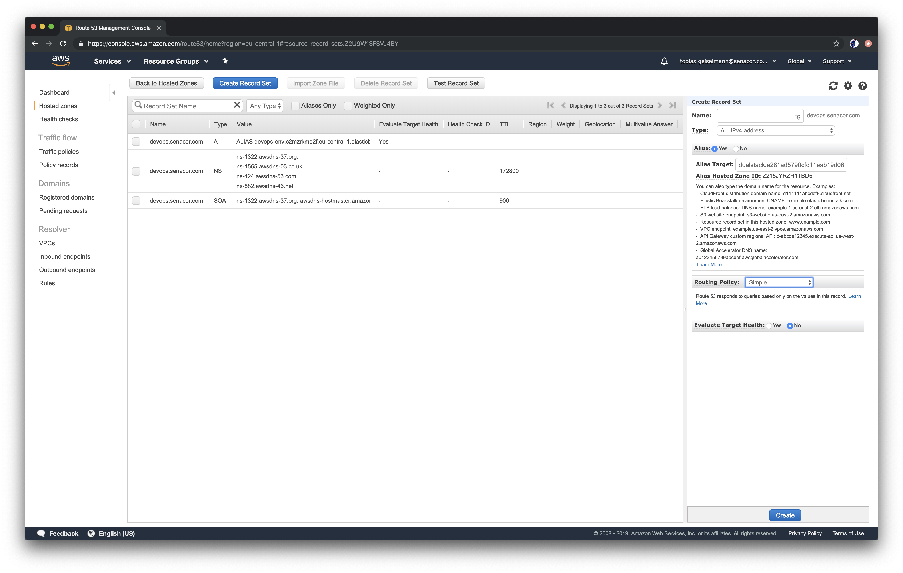
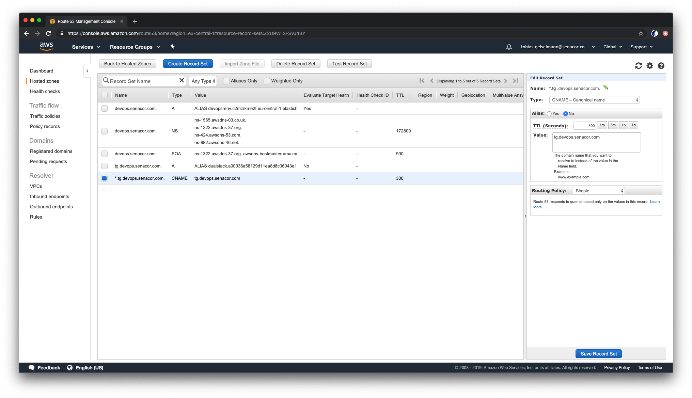

# Providing a domain name for our application

Running the application with an AWS LoadBalancer URl is fine, but that's really not how we want things to be. So now we are going to make our application available under `devops.senacor.com` with a real SSL certificate. In order to issue certificates in our cluster, we will install [`cert-manager`](https://docs.cert-manager.io/en/latest/) and create a `ClusterIssuer`.

## Deploying `cert-manager`

Create a namespace for cert-manager to live in:

```bash
kubectl create namespace cert-manager
```

Install cert-manager with all necessary resources:

```bash
kubectl apply -f https://github.com/jetstack/cert-manager/releases/download/v0.11.0/cert-manager.yaml --validate=false
```

Next, we are going to create a `ClusterIssuer`, that's configured to issue Let's Encrypt certificates. For the moment, we will only use the staging server, which only issues fake certificates, but we will switch to the production server later. To prove, that we are owner of the domain `devops.senacor.com`, we need to solve a challenge from Let's Encrypt. In order to do so, we need to edit DNS records for the domain. In our terraform script that we applied earlier, we created access keys for an IAM user. We will store the secret key in a Kubernetes secret now and configure the access key in the template for the `ClusterIssuer`. We saved the secret key earlier in a file called `secret.txt`. You can get the secret key by running the following command in the folder `devops-training-infrastructure/terraform/eks/`:

```bash
cd ~/devops-training/devops-training-infrastructure/terraform/eks
terraform output secret-key
```

Now create a Kubernetes secret from it:

```bash
kubectl create secret generic route53-secret -n cert-manager --from-literal=secret-access-key=<your-secret-key>
```

Now you need to update the file `issuer-staging.yaml` and insert your email address and the access key for the IAM user. You can get the access key by running the following command in the folder `devops-training-infrastructure/terraform/eks/`:

```bash
terraform output access-key
```

Now edit the file `devops-training-application/deploy/issuer-staging.yaml` and enter the access key and your email address:

```yaml
apiVersion: cert-manager.io/v1alpha2
kind: ClusterIssuer
metadata:
  name: letsencrypt-staging
spec:
  acme:
    # The ACME server URL
    server: https://acme-staging-v02.api.letsencrypt.org/directory
    # Email address used for ACME registration
    email: <your-email-address>
    # Name of a secret used to store the ACME account private key
    privateKeySecretRef:
      name: letsencrypt-staging
    # Enable the HTTP-01 challenge provider
    http01: {}
    dns01:
    solvers:
      - selector:
          dnsZones:
            - 'devops.senacor.com'
        dns01:
          route53:
            region: eu-central-1
            accessKeyID: <your-access-key>
            secretAccessKeySecretRef:
              name: route53-secret
              key: secret-access-key
```

Now we can create the `ClusterIssuer`:

```bash
cd ~/devops-training/devops-training-application/deploy
kubectl apply -f issuer-staging.yaml
```

## Deploying the Nginx Ingress

Now that we can issue certificates, we need a way to expose our application with DNS names. For that, we are going to use an [Ingress controller based on Nginx](https://github.com/kubernetes/ingress-nginx).

Let's deploy the mandatory resources, which can be used for any Kubernetes setup

```bash
kubectl apply -f https://raw.githubusercontent.com/kubernetes/ingress-nginx/master/deploy/static/mandatory.yaml
```

Since we use Amazon's EKS, we need to deploy some AWS-specific resources:

```bash
kubectl apply -f https://raw.githubusercontent.com/kubernetes/ingress-nginx/master/deploy/static/provider/aws/service-l4.yaml
kubectl apply -f https://raw.githubusercontent.com/kubernetes/ingress-nginx/master/deploy/static/provider/aws/patch-configmap-l4.yaml
```

## Creating a custom subdomain

Now we have an Nginx that can manage all the incoming traffic to our cluster. By default, it is exposed via an LoadBalancer. Let's get the URL for that and create a custom domain. Run the following command to get the URL of the LoadBalancer:

```bash
kubectl get services -n ingress-nginx
```

Output:

```bash
NAME            TYPE           CLUSTER-IP       EXTERNAL-IP                                                                  PORT(S)                      AGE
ingress-nginx   LoadBalancer   172.20.151.204   a3d73f5f4128811eab3dd064c09e343c-1144535697.eu-central-1.elb.amazonaws.com   80:31370/TCP,443:30146/TCP   2m
```

Copy the `EXTERNAL-IP`, switch to the Route53 page and select the Hosted Zone called `devops.senacor.com`. Click `Create Record Set` on the top and create an `A` Record Set with your prefix that you configured in the `ingress.yaml` as name. Set `Alias` to `yes` and select the Load Balancer DNS name you just copied from the dropdown menu. Hit `Create`.



Now click `Create Record Set` again and create a `CNAME` record, with the name `*.<prefix>` (replace your prefix) and enter the name of the `A` record you just created as value (which is `<prefix>.devops.senacor.com`).



## Routing traffic with fake certificates

Now we only need to create an `Ingress`, that configures how traffic gets routed our DNS name to services. You will find a prepared one under `devops-training-application/deploy/ingress.yaml`. You only need to configure the prefix for your subdomain that you just created in line 11 and 19:

```yaml
apiVersion: extensions/v1beta1
kind: Ingress
metadata:
  name: application-ingress
  namespace: voting
  annotations:
    cert-manager.io/cluster-issuer: letsencrypt-staging
    nginx.ingress.kubernetes.io/rewrite-target: /
spec:
  rules:
    - host: <prefix>.devops.senacor.com
      http:
        paths:
          - backend:
              serviceName: frontend
              servicePort: 80
  tls:
    - hosts:
        - <prefix>.devops.senacor.com
      secretName: letsencrypt-staging
```

Apply the ingress resource:

```bash
kubectl apply -f ingress.yaml
```

You need to wait a short while for our ClusterIssuer to issue and validate the certificate. You can check if it's ready by running:

```bash
kubectl get certificate -n voting
```

Output:

```bash
NAME                  READY   SECRET                AGE
letsencrypt-staging   True    letsencrypt-staging   1m30s
```

Once it says `READY = True`, you can open the URL (`<prefix>.devops.senacor.com`) in your browser. Your browser might complain about this being an insecure page and not opening it. If you accept the exception, you will see our application. You can also check with `curl`:

```bash
curl -k -L <prefix>.devops.senacor.com
```

## Issuing real certificates

Let's fix the warnings by switching to the Let's Encrypt production server and issuing a real certificate. Open the file `issuer-production.yaml`, enter your email address and the access key again, that we've already used for the staging issuer:

```yaml
apiVersion: cert-manager.io/v1alpha2
kind: ClusterIssuer
metadata:
  name: letsencrypt-production
spec:
  acme:
    # The ACME server URL
    server: https://acme-v02.api.letsencrypt.org/directory
    # Email address used for ACME registration
    email: <your-email-address>
    # Name of a secret used to store the ACME account private key
    privateKeySecretRef:
      name: letsencrypt-production
    # Enable the HTTP-01 challenge provider
    http01: {}
    dns01:
    solvers:
      - selector:
          dnsZones:
            - 'devops.senacor.com'
        dns01:
          route53:
            region: eu-central-1
            accessKeyID: <your-access-key>
            secretAccessKeySecretRef:
              name: route53-secret
              key: secret-access-key
```

And deploy the production ClusterIssuer:

```bash
kubectl apply -f issuer-production.yaml
```

Now we need to update our Ingress. Open the file `devops-training-application/deploy/ingress.yaml` and update the annptation in line 7 and the `secretName` in line 20 to `letsencrypt-production`:

```yaml
apiVersion: extensions/v1beta1
kind: Ingress
metadata:
  name: application-ingress
  namespace: voting
  annotations:
    cert-manager.io/cluster-issuer: letsencrypt-production
    nginx.ingress.kubernetes.io/rewrite-target: /
spec:
  rules:
    - host: tg.devops.senacor.com
      http:
        paths:
          - backend:
              serviceName: frontend
              servicePort: 80
  tls:
    - hosts:
        - tg.devops.senacor.com
      secretName: letsencrypt-production
```

Now apply these changes:

```bash
kubectl apply -f ingress.yaml
```

Let's take a look at our certificates again:

```bash
kubectl get certificates -n voting
```

After a little while, you should see a ready-to-use production certificate:

```bash
NAME                     READY   SECRET                   AGE
letsencrypt-production   True    letsencrypt-production   3m
```

Now open your application in the browser (`https://<prefix>.devops.senacor.com`) and the connection should be secure!
