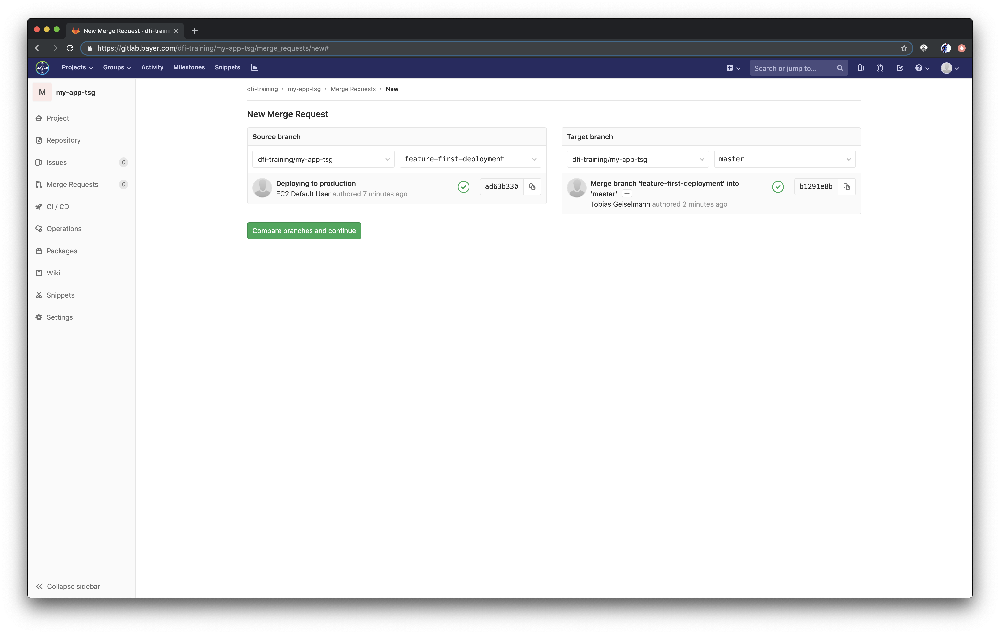
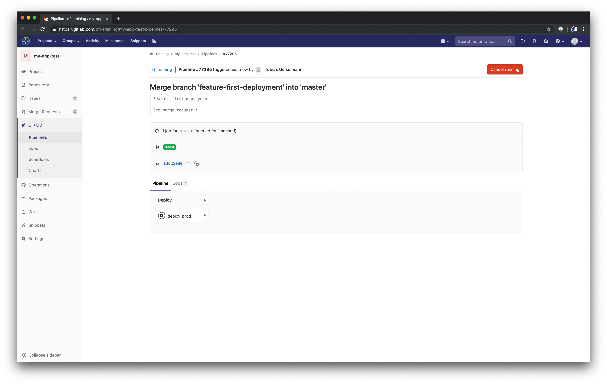
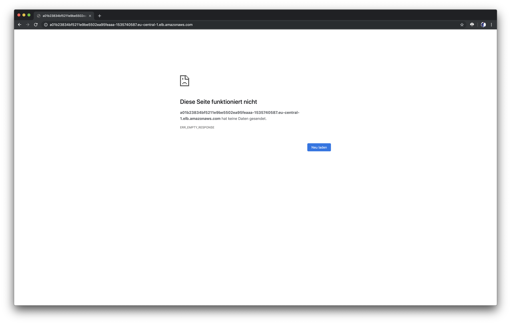
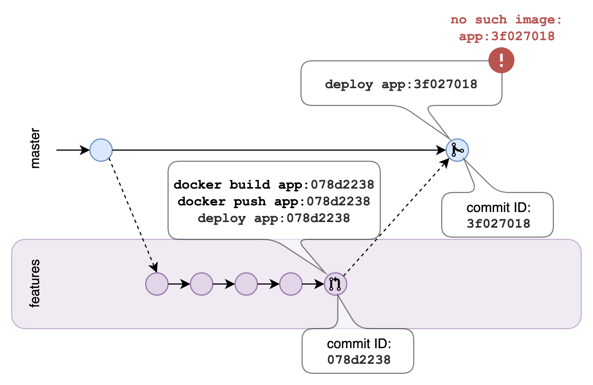

# Production Deployments with Merge Requests

Quick Recap: Our pipeline tests, builds and deploys our application to our test environment automatically, when we push changes to our feature branch (or, to be exact, any branch except `master`). But how do we deploy into production? We should extend our pipeline with an additional step that deploys the latest stable version of our application to our production environment. When should this pipeline run? Every time code changes happen in the master branch.

That leaves us with one last question: how do changes get into the master branch?

??? note "Hint: NOT by simply pushing to the master branch"
    Changes in the master branch happen ONLY by creating Merge Requests and merging feature branches into the master branch.

So let's put a step into our pipeline that deploys to production. It's almost the same as the deployment to the test environment. You only need to change the environment name to `prod` and make sure that it only runs for the master branch. Additionally, we add `when: manual`, so that the deployment starts only after we manually approved it. Add the following lines to the end of your pipeline definition:

**_devops-training-application/.gitlab-ci.yml:_**

```yaml
deploy_prod:
  stage: deploy
  environment:
    name: prod
  script:
    - aws eks update-kubeconfig --name $KUBERNETES_CLUSTER --region $REGION
    - cat deploy/application.yaml.tmpl | envsubst "`env | awk -F = '{printf \" \\\\$%s\", $1}'`" | kubectl apply -f -
  only:
    - master
  when: manual
```

Let's commit and push these changes to see the production deployment in action:

```bash
cd ~/devops-training/devops-training-application/
git add .
git commit -m "Deploying to production"
git push
```

After that, go to your Gitlab project and choose `Merge Request` from the left-side menu. Create a new merge request and choose the feature branch as source and the master branch as target.



Hit `Compare branches and continue`. You can add a description and change the title here. Hit `Submit merge request`. You have to approve your own merge request here, but usually you would assign it to a colleague of yours. When the merge request was accepted and the branch got merged, you will see that the pipeline step that we defined for the master branch has been created. When you click the little play button, you give your manual approval and the pipeline will start.



Great! We created a new namespace called `prod` where we deployed our application to. Let's see if the application works. Get the LoadBalancer URL and open it from your browser:

```bash
kubectl get svc frontend -n prod
```

You might see the following screen:



Hmm, that seems weird! Obviously our manual smoke test did not work, we can't access the application. Well, dear DevOps aspirant, time for a little adventure. It's your turn to find out what went wrong. But don't worry, I will guide you with a few tips.

??? note "Tip 1: Don't know where to start?"
    `kubectl` is your friend. You can use it to dig deeper into your deployments.

??? note "Tip 2: Look at the deployments"
    `kubectl get deploy frontend -n prod` gives you some information about the deployment of our application. Maybe you see something there that seems odd. The output looks like this:

    ```bash
    NAME       READY   UP-TO-DATE   AVAILABLE   AGE
    frontend   0/1     1            0           9m5s
    ```

    Apparently the pods are not entering the ready state.

??? note "Tip 3: Look at the pods"
    `kubectl get pods --selector=app=frontend -n prod` will show you the pods that belong to the `frontend` application.

    ```bash
    NAME                        READY   STATUS             RESTARTS   AGE
    frontend-675c588dc4-f6c8q   0/1     ImagePullBackOff   0          19m
    ```

    The status says `ImagePullBackOff` and the pod is not ready. For some reason, Kubernetes can't pull the image from our ECR registry. Any idea why?

??? note "Tip 4: Look deeper into the pod"
    `kubectl describe pod <your-pod-name> -n prod` will show you detailed information about the pod. At the bottom of the output you see some events that give you detailed information about what went wrong.

    ```bash
    Events:
      Type     Reason     Age                   From                                                  Message
      ----     ------     ----                  ----                                                  -------
      Normal   Scheduled  20m                   default-scheduler                                     Successfully assigned prod/frontend-675c588dc4-f6c8q to ip-10-0-1-132.eu-central-1.compute.internal
      Normal   Pulling    19m (x4 over 20m)     kubelet, ip-10-0-1-132.eu-central-1.compute.internal  pulling image "362403664804.dkr.ecr.eu-central-1.amazonaws.com/frontend-test:e3d25e8e"
      Warning  Failed     19m (x4 over 20m)     kubelet, ip-10-0-1-132.eu-central-1.compute.internal  Failed to pull image "362403664804.dkr.ecr.eu-central-1.amazonaws.com/frontend-test:e3d25e8e": rpc error: code = Unknown desc = Error response from daemon: manifest for 362403664804.dkr.ecr.eu-central-1.amazonaws.com/frontend-test:e3d25e8e not found
      Warning  Failed     19m (x4 over 20m)     kubelet, ip-10-0-1-132.eu-central-1.compute.internal  Error: ErrImagePull
      Warning  Failed     5m53s (x66 over 20m)  kubelet, ip-10-0-1-132.eu-central-1.compute.internal  Error: ImagePullBackOff
      Normal   BackOff    42s (x89 over 20m)    kubelet, ip-10-0-1-132.eu-central-1.compute.internal  Back-off pulling image "362403664804.dkr.ecr.eu-central-1.amazonaws.com/frontend-test:e3d25e8e"
    ```

    See what it says there? `Failed to pull image "362403664804.dkr.ecr.eu-central-1.amazonaws.com/frontend-test:e3d25e8e"`

    Take a look into your ECR repository and try to find out why Kubernetes can't pull the Docker image with that specific tag.

??? note "The solution"
    Did you find out why Kubernetes can't pull the image with that specific tag? Did you even find an image with that specific tag? You can't, because it does not exist.

Let's take a look at a simple illustration:



Every time we push changes to the feature branch, we test and build a new Docker image tagged with the commit ID. Then we push that image to the ECR registry and deploy it. In the illustration above, the last commit ID on our feature branch is `078d2238`, so an image called `frontend:078d2238` got pushed to the ECR registry and Kubernetes pulled the very same image and deployed it. When we approve a merge request, we essentially create a new commit, in our case it has the ID `e3d25e8e`. We don't build our image again, because we already have a tested version, the one that we deployed to our test environment. So the only thing we want to do is a deployment to production. But if we tell Kubernetes to deploy the image `frontend:e3d25e8e`, it won't find it in our registry.

## Pull-push mechanism

So how do we fix this problem? It's actually pretty simple. We have to provide an image to Kubernetes that has the correct tag. To achieve that, we pull the image that we deployed to our test environment, tag it with the new commit ID and push it to the ECR registry. All in all, you need to include this pipeline step before your production deployment:

**_devops-training-application/.gitlab-ci.yml:_**

```yaml
pull_push_image:
  stage: pull_push
  script:
    - $(aws ecr get-login --no-include-email --region eu-central-1)
    - docker pull $REPOSITORY_URL:latest
    - docker tag $REPOSITORY_URL:latest $REPOSITORY_URL:$CI_COMMIT_SHORT_SHA
    - docker push $REPOSITORY_URL:$CI_COMMIT_SHORT_SHA
  only:
    - master
```

??? note "For reference: complete .gitlab-ci.yml"
    **_devops-training-application/.gitlab-ci.yml:_**

    ```yaml
    image: docker:latest

    variables:
      DOCKER_TLS_CERTDIR: ""
      REGION: eu-central-1
      REPOSITORY_URL: 604370441254.dkr.ecr.eu-central-1.amazonaws.com/frontend-tg
      KUBERNETES_CLUSTER: terraform-eks-tg
      PREFIX: tg

    services:
      - docker:dind

    before_script:
      - apk add --no-cache curl jq python py-pip gettext
      - pip install awscli
      # Add the lines below to make the CLI available in our build container
      - curl -LO https://storage.googleapis.com/kubernetes-release/release/$(curl -s https://storage.googleapis.com/kubernetes-release/release/stable.txt)/bin/linux/amd64/kubectl && mv kubectl /usr/local/bin && chmod +x /usr/local/bin/kubectl
      - curl -o aws-iam-authenticator https://amazon-eks.s3-us-west-2.amazonaws.com/1.12.7/2019-03-27/bin/linux/amd64/aws-iam-authenticator && chmod +x ./aws-iam-authenticator && mkdir -p $HOME/bin && cp ./aws-iam-authenticator $HOME/bin/aws-iam-authenticator && export PATH=$HOME/bin:$PATH

    stages:
      - test
      - build
      - pull_push
      - deploy
      - smoke_test

    test:
      stage: test
      image: node:12.1-alpine
      script:
        - cd ./app && npm install && npm test
      except:
        - master

    build:
      stage: build
      script:
        - $(aws ecr get-login --no-include-email --region eu-central-1)
        - docker build -t $REPOSITORY_URL:$CI_COMMIT_SHORT_SHA -t $REPOSITORY_URL:latest ./app
        - docker push $REPOSITORY_URL:$CI_COMMIT_SHORT_SHA
        - docker push $REPOSITORY_URL:latest
      except:
        - master

    deploy_test:
      stage: deploy
      environment:
        name: test
      script:
        - aws eks update-kubeconfig --name $KUBERNETES_CLUSTER --region $REGION
        - cat deploy/application.yaml.tmpl | envsubst "`env | awk -F = '{printf \" \\\\$%s\", $1}'`" | kubectl apply -f -
      except:
        - master

    smoke_test_staging:
      stage: smoke_test
      environment:
        name: test
      script:
        - aws eks update-kubeconfig --name $KUBERNETES_CLUSTER --region $REGION
        - kubectl rollout status deploy frontend -n $CI_ENVIRONMENT_SLUG
        # If the service is deployed, the curl command will show an HTTP status code 200 and return with 0, suggesting that the deployment was successful
        - curl -I $(kubectl get ingress application-ingress -n $CI_ENVIRONMENT_SLUG -o json | jq -r ".spec.rules[0].host")
      when: delayed
      start_in: 2 minutes
      except:
        - master

    pull_push_image:
      stage: pull_push
      script:
        - $(aws ecr get-login --no-include-email --region eu-central-1)
        - docker pull $REPOSITORY_URL:latest
        - docker tag $REPOSITORY_URL:latest $REPOSITORY_URL:$CI_COMMIT_SHORT_SHA
        - docker push $REPOSITORY_URL:$CI_COMMIT_SHORT_SHA
      only:
        - master

    deploy_prod:
      stage: deploy
      environment:
        name: prod
      script:
        - aws eks update-kubeconfig --name $KUBERNETES_CLUSTER --region $REGION
        - cat deploy/application.yaml.tmpl | envsubst "`env | awk -F = '{printf \" \\\\$%s\", $1}'`" | kubectl apply -f -
      only:
        - master
      when: manual
    ```

Commit and push your changes to the feature branch:

```bash
cd ~/devops-training/devops-training-application/
git add .
git commit -m "Implementing pull push mechanism"
git push
```

After the pipeline has finished for your test environment, you can create a new merge request, assign it to yourself and watch the production deployment, after you approved your merge request. You will need to manually approve the deploy step. Once it's finished, open `https://prod.<prefix>.devops.senacor.com` in your browser and you should see your application!
