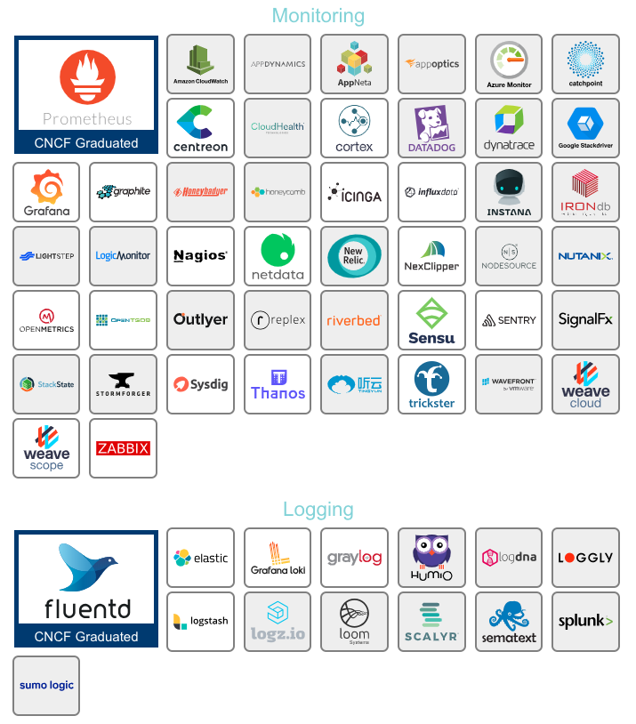

# 09 - Monitoring & Logging

Now that our application is up and running, we're done here, aren't we? We are providing our application to our customers, everyone is happily using it, what else is there to do for us?

Well, what if not all of our customers are happily using our service? What if something goes wrong? What if our application fails?

Let's be honest: even if you put an incredible amount of time into testing your code and fixing all bugs, something will probably still go wrong. And that is absolutely fine. As long as you are able to detect that something did go wrong and you have the ability to trace down to the cause of the problem. Or even better, what if you could react before something went wrong? The good news is: it is possible. And there is tooling that will help us. Let's get it going.

## Logging

Logs come in a great variety of forms. They are usually written inside the context of an application and they represent that something happened, en event. The most typical usecase in web-based applications is request logging. Every time a request hits your server, you write a line to your log file. Typically it contains information about the endpoint that was called, the execution time of the request, the HTTP status code it returned with, the source IP that it originated from and so on. The format can differ, but often it looks something like this:

```json
{
  "time_local": "06/May/2019:03:26:31 +0000",
  "remote_addr": "10.221.16.1",
  "remote_user": "",
  "request": "GET /ping HTTP/1.1",
  "request_body": "",
  "status": "200",
  "body_bytes_sent": "494",
  "request_time": "3.006",
  "response_time": "3.006",
  "http_user_agent": "Go-http-client/1.1"
}
```

Logs are usually shipped to a central storage (we will use an EFK stack for that purpose later on) where they are aggregated and you can query them and build graphs to provide meaningful data out of them.

## Monitoring

When we speak about monitoring, we think of observing certain metrics and their development over time. There are many different metrics that can be monitored. Some of the most common are:

- CPU utilization
- Memory usage
- Error rates
- Application availability
- Number of requests

When we look at a histogram of these values (a graph that displays the values over time), we can see when anomalies happened. For example, if our application crashes after some execution time and we look at the memory usage and see that it is constantly rising, we can conclude that the application is crashing due to a lack of memory (which the logs will probably tell us, too) and we could start to look for the cause (maybe a memory leak). To be able to react before something goes wrong, we can add alerting to our monitoring. This will send us an alert based on some rules. A typical example is to trigger an alarm after the CPU utilization exceeded a threshold of 75% over a time span of 5 minutes. We could then go in and scale our application up (or even automate the scaling).

## Monitoring vs. Logging

We could build a graph that shows us the number of requests both by looking at metrics and at log files. So what is better now? The short answer: both. Logging and monitoring are not contrary, they are complementary. While you can get some information from both logging and monitoring, monitoring metrics gives you a good overview over all your systems and subsystems. Logging gives you detailed information of single events or requests. You could start by looking at your metrics to see that a subsystem is behaving anomalously and you could then dig in and look at log files to see what's really going on.

## Technical solutions

If we look at the [CNCF landscape](https://landscape.cncf.io/) we see that there are a lot of tools for monitoring and logging.



For the sake of our workshop, we will pick the ones that are widely adopted and are therefore CNCF Graduated. For monitoring, we will use Prometheus combined with Grafana. For logging we will use an EFK stack, which consists of Elasticsearch for indexing and processing the logs, fluentd for shipping the logs and Kibana to build dashboards and query the stored logs.
