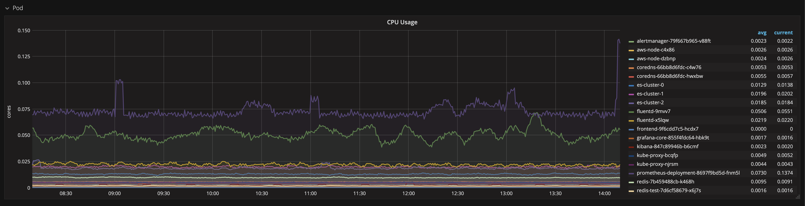

# 10 - Setting up Monitoring

Monitoring is one important aspect of DevOps. When the application is developed and deployed, it is crucial to monitor all of our infrastructure and applications, from network metrics, over host-level metrics to application- and service-level metrics. Prometheus is the leading open-source monitoring and altering solution where data is stored as realtime metrics in a time-series database.

Prometheus works in the following way:

- You define the targets that you want to monitor (could be your Kubernetes nodes, containers, or something else)
- The targets must expose their metrics in a text-based format over an endpoint, typically this is /metrics
- Prometheus scrapes its configured target in defined time intervals to get the metrics and stores them
- You can then query Prometheus to provide you with information from these metrics. Typically this is done in combination with Grafana graphs

## Deploying Prometheus, AlertManager and Grafana

We've already prepared the Kubernetes manifests that you need to deploy Prometheus and Grafana:

```bash
cd ~/devops-training
git clone https://github.com/senacor/devops-training-monitoring-logging.git
```

You can deploy the stack by simply running:

```bash
cd ~/devops-training/devops-training-monitoring-logging/deploy
kubectl apply -f monitoring/
```

If you look at the services, you will see that all are exposed via a LoadBalancer, so we can access them from the browser:

```bash
kubectl get svc -n monitoring
```

```bash
NAME                 TYPE           CLUSTER-IP       EXTERNAL-IP                                                                  PORT(S)        AGE
grafana              LoadBalancer   172.20.91.54     a8790f3dca2ef11e98b7b0217677ec25-214189020.eu-central-1.elb.amazonaws.com    80:32176/TCP   95m
prometheus-service   LoadBalancer   172.20.199.182   a8778ae99a2ef11e98b7b0217677ec25-2093395566.eu-central-1.elb.amazonaws.com   80:32083/TCP   95m
```

Access Grafana with the URL of the LoadBalancer. The default login credentials for Grafana are `admin` and `admin`.


The first thing we need to do here is adding Prometheus as our data source so we can access the metrics it scraped. Click on Add data source. Configure it in the following way:

- Name: `prometheus`
- Type: `Prometheus`
- Url: `<Prometheus-LoadBalancer-URL>` (make sure that it starts with `http://`)
- Access: `direct`

When you click Add, you should see that the data source is working.


## Building our first dashboard

Grafana dashboards are a great way to display the metrics that Prometheus is capturing. Those dashboards are not only useful, they also look awesome. Grafana provides a central repository, where you can discover and share dashboards. Go over there and feel free to explore some dashboards for a few minutes so you can get a feeling what you are able to build with Grafana: [Grafana Dashboards](https://grafana.com/dashboards)

Reusing and sharing dashboards is great, but today we want to understand how we can built our own dashboards. So let's get started!

Click the Grafana logo in the top-left corner and choose `Dashboards > New`. We will use rows in our dashboard to distinguish different abstraction layers. Start by adding two rows to your dashboard:


Hover over the little three dots on the left side of the rows and choose `Row Options`. Give the upper row the title `Pod` and the lower row the title `Cluster`. Make sure that the `Show` checkbox is checked. Hover over the three dots in the upper row again and choose `Add panel`. Choose a `Graph` panel. Then open the `Add panel` dialog again and add another `Graph`.


We are going to do an initial setup for these panels first, so we can copy them for the Cluster row.

### CPU Template panel

Click the title of the left graph and choose Edit.  Fill out the General, Axes, Legend and Display tabs as shown in the screenshots below:

General Tab:


Axes Tab:


Legend Tab:


Display Tab:


### Memory Template panel

Now edit the right graph and fill out the tabs as in the screenshots below:

General Tab:


Axes Tab:


Legend Tab:


Display Tab:


Click `Back to Dashboard`. Duplicate the two graphs by hovering over them and clicking `Duplicate`. Drag the duplicated ones to the second row and resize everything properly, so it should look like this:


## Querying Prometheus

Now that we built the skeleton for our dashboard, we are going to write some queries to get data from Prometheus into our graph.

### Pod-level metrics

Edit the CPU usage graph in the Pod row. In the Metrics tab, enter the following Query:

```bash
sum(rate(container_cpu_usage_seconds_total{container_name!="POD",pod_name!=""}[5m])) by (pod_name)
```

Enter `{{pod_name}}` in the field Legend format.


You should see your first graph now:



Update the Pod Memory Usage graph with the following query:

```bash
sum(container_memory_usage_bytes{container_name!="POD",container_name!=""}) by (pod_name)
```

Enter `{{pod_name}}` in the Legend format field.

### Cluster-level metrics

We are going to update the graphs for the cluster-level metrics in the same way. Enter the following query:

```bash
sum(rate(container_cpu_usage_seconds_total{id="/"}[1m])) / sum(machine_cpu_cores) * 100
```

Enter `Cluster` in the Legend format field. In the Axes tab, change the Unit to `percent (0 - 100)` (grouped in the category `none`):


For the cluster memory usage, enter the following query:

```bash
sum(container_memory_usage_bytes{container_name!="POD",container_name!=""}) / sum(machine_memory_bytes) * 100
```

Enter `Cluster` in the Legend format field. In the Axes tab, change the Unit to `percent (0 - 100)` (grouped in the category `none`).

Your final dashboard should look like this:


In case anything went wrong or you want to save some time, you can import the dashboard from `dashboards/Kubernetes_Overview.json`.

## Instrumenting Redis

A dashboard that gives us an overview of memory and CPU usage in our Kubernetes cluster is useful for every Kubernetes cluster that you operate. Additionally, it is very useful to build some application-specific dashboards, that give you inisghts about the state of your specific application. Therefore we are going to instrument our Redis to get more metrics from it.

Redis can't be instrumented directly by Prometheus, because it does not expose any metrics by default. So we will use an exporter that gives the metrics that we want to extract from Redis. This exporter will be running as a second container inside the pod where Redis is executed. Luckily, a working exporter for Redis is already available: https://github.com/oliver006/redis_exporter

We already added the second container to our pod when we automated the deployment (it was contained in the `application.yaml.tmpl` file). You can see it below, we have a second container defined for our Deployment:

```yaml
apiVersion: apps/v1
kind: Deployment
metadata:
  name: redis
  namespace: voting
spec:
  selector:
    matchLabels:
      app: redis
  template:
    metadata:
      annotations:
        prometheus.io/scrape: 'true'
        prometheus.io/port: '9121'
      labels:
        app: redis
    spec:
      containers:
        - name: redis
          image: redis
          resources:
            limits:
              memory: '128Mi'
              cpu: '500m'
          ports:
            - containerPort: 6379
          command:
            - redis-server
            - '/redis-master/redis.conf'
          volumeMounts:
            - mountPath: /redis-master
              name: config
        - name: redis-exporter
          image: oliver006/redis_exporter:latest
          resources:
            requests:
              cpu: 100m
              memory: 100Mi
          ports:
            - containerPort: 9121
          env:
            - name: REDIS_ADDR
              value: redis.voting.svc.cluster.local:6379
      volumes:
        - name: config
          configMap:
            name: redis-config
```

In order to get our new metrics, we need to tell Prometheus where to find them. It needs a DNS name and a port where it can scrape the data. If you look at the last few lines in the file `monitoring/30_configmap.yaml`, you will see the following lines that tell Prometheus to get metrics from the redis-exporter. The redis-exporter is exposed via a Service defined in `monitoring/60_redis-exporter-svc.yml`.

```yaml
scrape_configs:
---
- job_name: redis_exporter
  static_configs:
    - targets: ['redis-monitor-svc.voting.svc.cluster.local:9121']
```

But since we've already applied those manifests, there's nothing to do here for you. Access your Prometheus server at the LoadBalancer URL to check that the target got registered. Go to Status > Targets, it should be listed there:


Now access Grafana and click the Grafana icon in the top left corner. Choose `Dashboards > Import` and copy-paste the contents from the file `monitoring-logging/dashboards/Prometheus_Redis_Dashboard.json` into the JSON textarea. Hit `Load` and choose the Prometheus data source that we added earlier. Then click `Import` and you will see your brand-new dashboard. Choose the `prod` namespace and the `redis` instance at the top.


