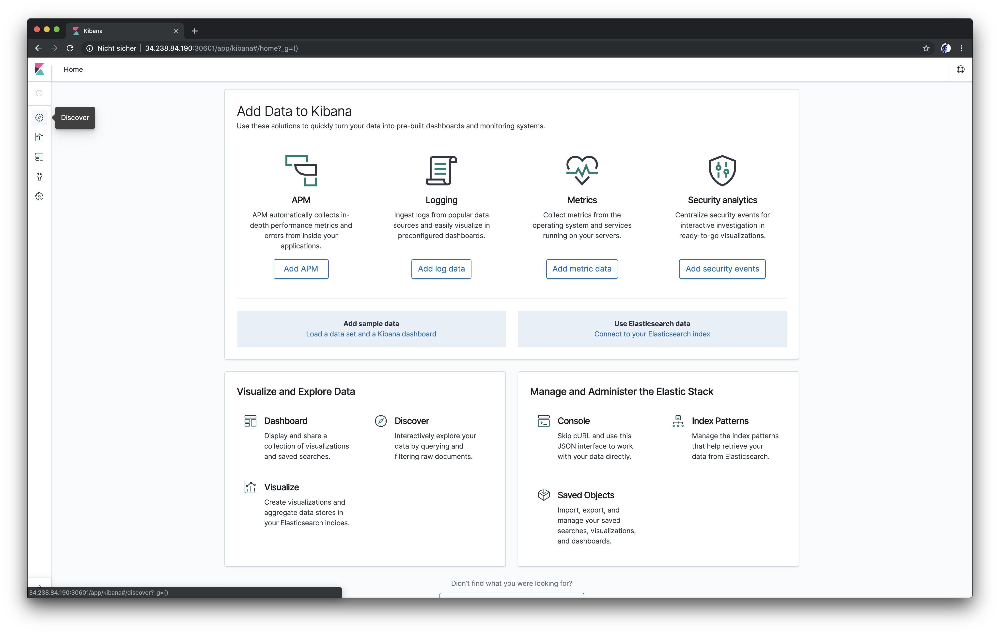
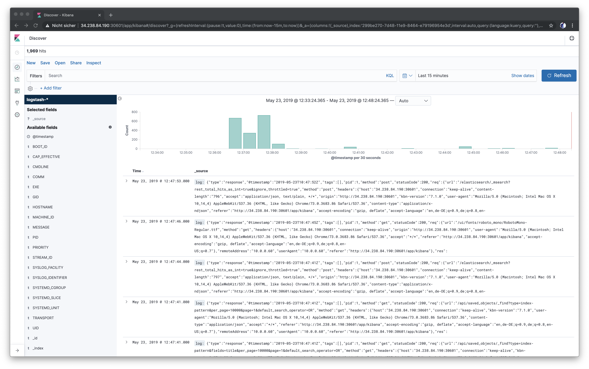
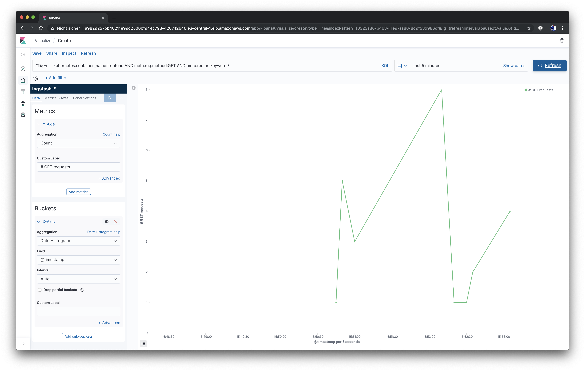
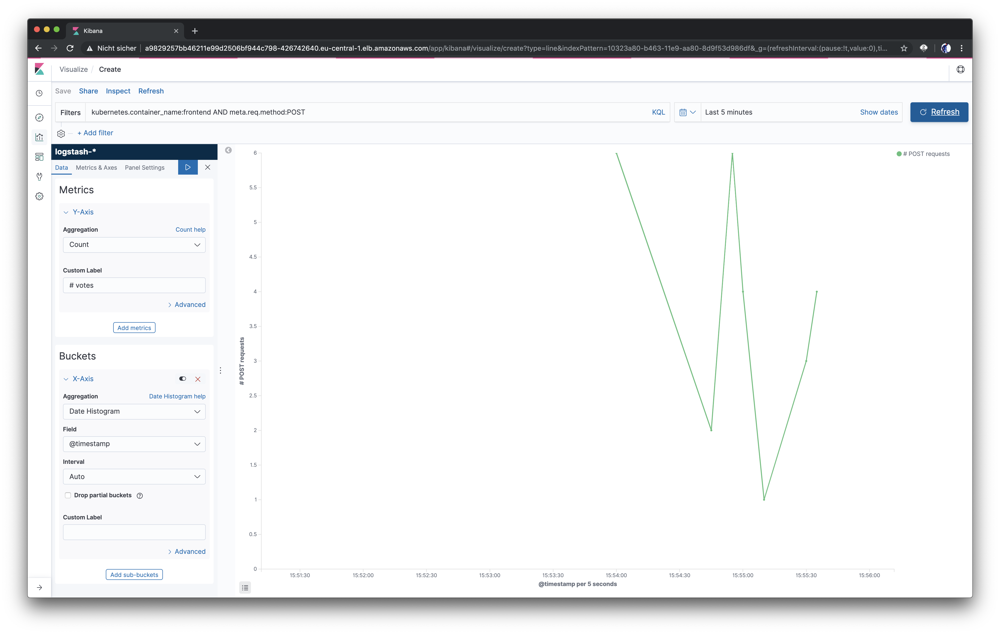
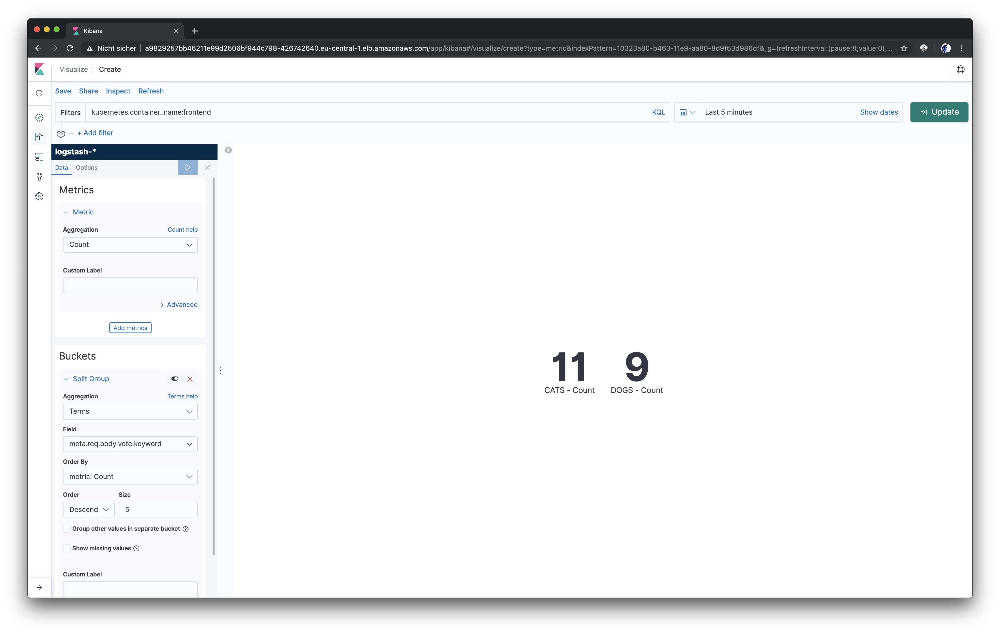
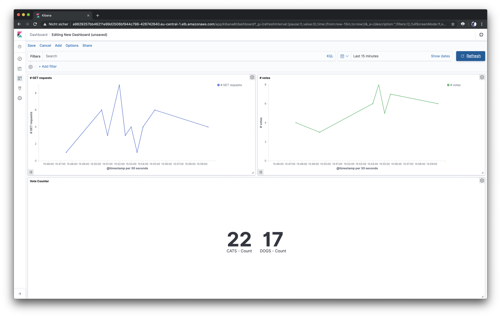

# 11 - Deploying an EFK stack and collecting logs

To explore logging and log dashboards a bit more, we are going to deploy an EFK stack to our cluster now. If you did not clone the repository for the monitoring stack in the previous step, you can do so now:

```bash
cd ~/devops-training
git clone https://github.com/senacor/devops-training-monitoring-logging.git
```

Let's summarize what the goal of our logging stack is:

- We want to collect the logs that our Docker containers write and store them centrally in an Elasticsearch instance
- By default Docker logs go to `/var/lib/docker/containers/<container id>/<container id>-json.log`, we need to pick them up there with Fluentd
- Our containers could run on any of our Kubernetes nodes, so we need to deploy Fluentd to every node
- When the logs are collected and indexed, we want to build dashboards with Kibana

## The Kubernetes objects

We want to deploy Elasticsearch as a cluster with three instances. For that we are going to use a [Statefulset](https://kubernetes.io/docs/concepts/workloads/controllers/statefulset/), which is a special Kubernetes deployment controller that manages the deployment and scaling of a set of Pods and provides guarantees about the ordering and uniqueness of these Pods.

**_monitoring-logging/deploy/logging/20_elasticsearch-statefulset.yaml:_**

```yaml
apiVersion: apps/v1
kind: StatefulSet
metadata:
  name: es-cluster
  namespace: logging
spec:
  serviceName: elasticsearch
  replicas: 3
  selector:
    matchLabels:
      app: elasticsearch
  template:
    metadata:
      labels:
        app: elasticsearch
    spec:
      containers:
        - name: elasticsearch
          image: docker.elastic.co/elasticsearch/elasticsearch-oss:7.1.0
```

As you can see, we define a StatefulSet with three replicas of a standard open-source Elasticsearch image.

Kubernetes provides a special object called DaemonSet, that ensures that all Nodes of the cluster run a copy of a Pod. For our Fluentd deployment, that is exactly what we want to use:

**_monitoring-logging/deploy/logging/30_fluentd.yaml:_**

```yaml
apiVersion: apps/v1
kind: DaemonSet
metadata:
  name: fluentd
  namespace: logging
  labels:
    app: fluentd
spec:
  selector:
    matchLabels:
      app: fluentd
  template:
    metadata:
      labels:
        app: fluentd
    spec:
      serviceAccount: fluentd
      serviceAccountName: fluentd
      tolerations:
        - key: node-role.kubernetes.io/master
          effect: NoSchedule
      containers:
        - name: fluentd
          image: fluent/fluentd-kubernetes-daemonset:v0.12-debian-elasticsearch
          env:
            - name: FLUENT_ELASTICSEARCH_HOST
              value: 'elasticsearch.logging.svc.cluster.local'
            - name: FLUENT_ELASTICSEARCH_PORT
              value: '9200'
            - name: FLUENT_ELASTICSEARCH_SCHEME
              value: 'http'
            - name: FLUENT_UID
              value: '0'
          resources:
            limits:
              memory: 512Mi
            requests:
              cpu: 100m
              memory: 200Mi
          volumeMounts:
            - name: varlog
              mountPath: /var/log
            - name: varlibdockercontainers
              mountPath: /var/lib/docker/containers
```

- We deploy a DaemonSet called fluentd with a special fluentd image for Kubernetes
- Via environment variables, we point Fluentd to the DNS name of our Elasticsearch cluster
- In line 81 and 82, we mount the directory where Docker writes the log files to, so we can forward everything that is written to the files there

The Kibana deployment is pretty straight-forward. We deploy one Pod and expose the service over a LoadBalancer to make it accessible with a browser.

## Deploy the EFK stack

Deploying the stack can be done by running one command from your terminal:

```bash
cd ~/devops-training/devops-training-monitoring-logging/deploy
kubectl apply -f logging/
```

After you've applied that, you can watch the status of the Elasticsearch cluster with the following command:

```bash
kubectl rollout status sts/es-cluster -n logging
```

Output:

```bash
Waiting for 3 pods to be ready...
Waiting for 2 pods to be ready...
Waiting for 1 pods to be ready...
partitioned roll out complete: 3 new pods have been updated...
```

After the rollout is complete, we can open Kibana and start building dashboards. Kibana is accessible over a LoadBalancer, which you can get with the following command:

```bash
kubectl get svc -n logging
```

```bash
NAME            TYPE           CLUSTER-IP       EXTERNAL-IP                                                                 PORT(S)             AGE
elasticsearch   ClusterIP      None             <none>                                                                      9200/TCP,9300/TCP   63m
kibana          LoadBalancer   172.20.189.139   a606263d7a2f411e98b7b0217677ec25-858637351.eu-central-1.elb.amazonaws.com   80:30175/TCP        63m
```

If you open Kibana in your browser, you should see the following. You might need to click `Explore on my own` first.



Click `Connect to your Elasticsearch index` in the center of the screen. On the next screen, enter the following index pattern: `logstash-*` and click `Next step`. Choose `@timestamp` from the dropdown for the Time Filter and hit `Create index pattern`.

Now click the little compass icon on the left side which takes you to the Discover screen:



Feel free to explore the logs a while. If you've never used Kibana before, here are a few tips:

On the left side you see all available fields. If you hover over one and click `Add`, the value of that field will be visible in the table.
You can filter by fields from the Search bar. If you want to see all requests that your application received in the `prod` namespace, add the following in the search bar: `kubernetes.namespace_name:prod AND kubernetes.container_name:frontend`

## Create a visualization

Now that we are able to collect our logs, let's visualize them. Click on the little graph icon in the left side menu that says `Visualize` and then click `Create a visualization`. We are going to build a `line graph` that displays a trend of the number of GET requests our Node.js application gets. Choose the index pattern that we created earlier and then configure your graph in the following way:

- Search bar: Enter `kubernetes.namespace_name:prod AND kubernetes.container_name:frontend AND meta.req.method:GET AND meta.req.url.keyword:/` here
- Y-Axis: Make sure that `Count` is selected for the Aggregation and enter `# GET requests` as Custom Label
- Buckets: choose `X-Axis`, select `Date Histogram` for the Aggregation and leave the rest as default.

Click the little blue play button to refresh the visualization. Make sure to generate some traffic, otherwise your visualization will be empty. Reload your web application a few times and you should see the graph.
Note: Voting is not displayed in this graph, since the votes are POST requests and the graph only counts GET requests.


Don't forget to save your visualization!

**Exercise**: Build another line graph that displays the trend of votes that are casted.

??? note "Solution - only open once finished :)" 
    - Search bar: Enter `kubernetes.namespace_name:prod AND kubernetes.container_name:frontend AND meta.req.method:POST` here 
    - Y-Axis: Make sure that `Count` is selected for the Aggregation and enter `# votes` as Custom Label 
    - Buckets: choose `X-Axis`, select `Date Histogram` for the Aggregation and leave the rest as default.

    

**Another exercise**: The last one was too easy, wasn't it? Now try to build two counters, that count the number of votes for the particular options.

??? note "Solution - only open once finished :)" 
    - Select the visualization type `Metric` 
    - Search bar: Enter `kubernetes.namespace_name:prod AND kubernetes.container_name:frontend` here 
    - Metric: Make sure that `Count` is selected for the Aggregation and leave the custom label empty 
    - Buckets: add a Split Group and choose `Terms` for the Aggregation. Then choose `meta.req.body.vote.keyword` as Field and leave the rest as default 
    - Don't forget to hit the little play button to update your metric and save your visualization

    

## Cretae a dashboard

Now that we built three visualizations, it's time to put them in a dashboard so we can get a quick overview. Click on the little dashboard icon on the left-side menu and then choose `Create new dashboard`. Let's do as the instructions say there and use the `Add` button to add our visualizations to the dashboard. Don't forget to save your dashboard!



## In a hurry? Import the objects

In case you're in a hurry or anything didn't work as expected, you can also go ahead and import the three visualizations and the dashboard that we created. Open Kibana, choose the little `Settings` icon from the left-side menu and navigate to `Saved Objects`. You will find an `Import` button there, where you can import the objects that can be found in `monitoring-logging/dashboards/kibana.json`. Make sure to choose your index pattern, when Kibana tells you about `Index Pattern Conflicts`.
