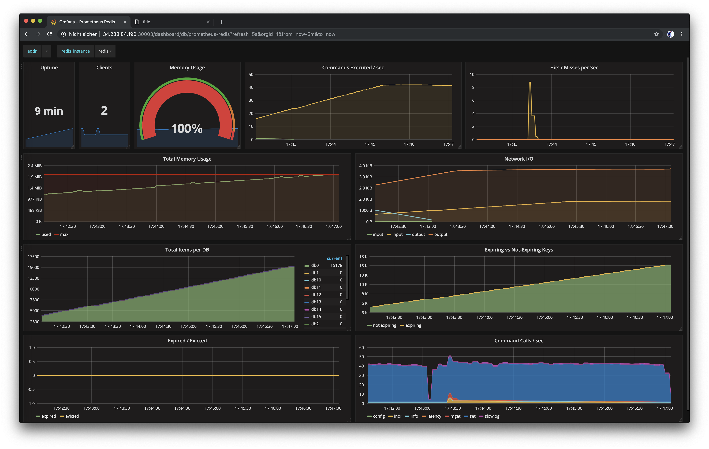

# Bug Hunting

You did a great job. You deployed your application, set up a monitoring solution, collected your logs... and it wasn't that hard, was it? You think you're done and can call it a day? Well... if it only was that easy. We've prepared one last adventure for you.

Go ahead and look at the Redis dashboard that we built with Grafana. Notice anything? If you don't notice anything, take a look at the gauge that displays the Redis memory usage.



So what is happening here? That doesn't look too good. It will be your task to find that out. We provided you with all the tools that are necessary. Now make use of them, this is your time to shine!

??? note "Hint - only open if you have really no clue"
    Something seems to fill up the Redis database, maybe the log files will provide more information...

??? note "Another hint"
    Search the log files for containers that have `redis` in their name, that might help...

??? note "Yet another hint"
    The container that's causing trouble is called `redis-filler`. Try to find out where it came from and find a way how to get rid of it.

??? note "Solution"
    We snuck a little container into your deployment that executes write commands to Redis in an endless loop. You can delete the pod like that:

    ```bash
    kubectl delete pod redis-filler -n prod
    ```

    Now you need to delete the deployment from our Kubernetes objects, otherwise it will be deployed again the next time. Delete the last deployment in the file `deploy/application.yaml.tmpl`.
