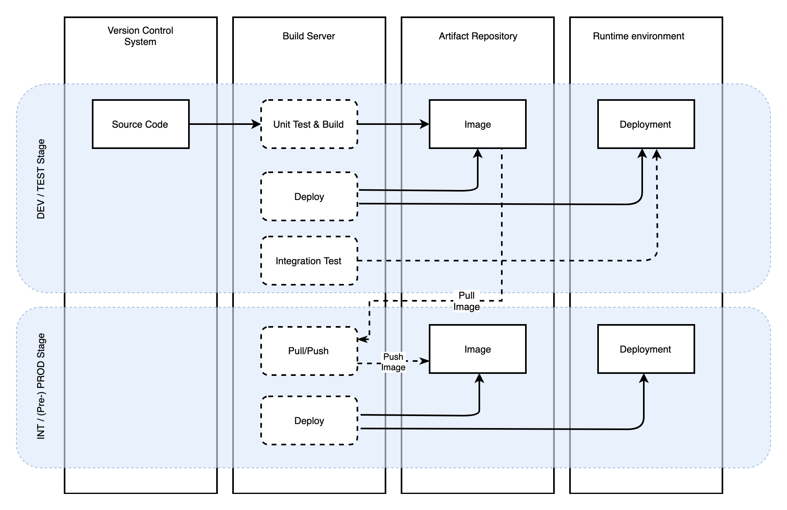
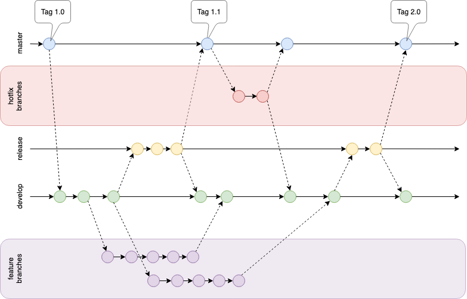
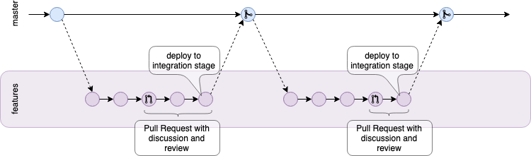

# Staging and Branching

This page provides an overview over a common staging concept.

|                                                                DEV                                                                |                                                               TEST                                                               |                                                                                               INT                                                                                                |                                                                     Pre-PROD (optional)                                                                     |                                                                 PROD                                                                  |
| :-------------------------------------------------------------------------------------------------------------------------------: | :------------------------------------------------------------------------------------------------------------------------------: | :----------------------------------------------------------------------------------------------------------------------------------------------------------------------------------------------: | :---------------------------------------------------------------------------------------------------------------------------------------------------------: | :-----------------------------------------------------------------------------------------------------------------------------------: |
| Intended for developers to quickly be able to test code in the running environment. No requirements for a stable running service. | Should reflect the latest version of the code. The build may (should) be automatically triggered as new code changes are pushed. | Provides a stable version of the running service which has passed the necessary integration tests. Service should be consumed by other systems in their own TEST and INT stages (or equivalent). | Service in a production environment, ready for production testing. Service is not yet reachable by the end-user. For some services, this stage is optional. | Production version of service for serving end-users. Testing should not be carried out here (other than standard health-checks etc.). |

## Branching models

Basically every software development project is using Git as a version control system these days. One important mechanism is branching. When used correctly, it can speed up your development workflow and enable efficient collaboration. There are two main methodologies which we are going to compare here: git-flow and Github Flow.

### git-flow

[git-flow](https://nvie.com/posts/a-successful-git-branching-model/) is a branching model developed by Vincent Driessen. The model consists of two main branches:

- master - main branch which always reflects a production-ready state
- develop - contains the latest delivered development changes

Whenever the develop branch reaches a stable state, it gets merged into the master branch. Theoretically, this state could be rolled out to production automatically.

Additionally, there are the following supporting branches:

- Feature branches
- Release branches
- Hotfix branches

Feature branches merge off from the develop branch. This is where new features are implemented, typically the name of the feature branch correlates with the name of the feature that is under development (e.g. `feature/the_next_big_thing`). The feature branch exists as long as the feature is under development. It will then be merged back into the develop branch or discarded, if the feature will not be integrated.

Release branches merge off from the develop branch, when the develop branch reflects the state of the next release. These branches are used to make the last minor adjustments before releasing new software (e.g. adjusting build versions, etc.). After the adjustments, the release branch must be merged into the develop and master branch. The commit where the release branch is merged into the master branch will receive a tag on the master branch with the release version number.

Hotfix branches are used for bug fixes in production code. They merge off from the master branch, since they are based on the latest released version of the code. After the bug fix is finished and working, a hotfix branch must be merged into the develop and the master branch. This way the Hotfix will make it into production and will be in all future releases.

### Github Flow

Github Flow is a branching model developed by Github, which is a light-weight and utilises less types of branches than git-flow. The only two branches that the Github Flow uses are:

- master branch
- feature branches

The master branch contains a production-ready state of the software at any point in time. More than that, every commit to the master branch should be automatically deployed. The development of new features takes place in feature branches, which are named by the feature that's under development. These branches are created directly off of the master branch. When it is time to merge a branch with a feature back into the master branch, Merge Requests are used. A Merge Request basically says "I need help to review this code" and "I want to merge this". Typically, a number of reviewers take a look at the code and decide whether to approve it or not. Additionally, the code is tested automatically and should be deployed to an integration stage at this point. If all tests (manual or automatic) pass and all reviewers approve, the branch is merged into the master. It should then be automatically deployed to production.

### Which one to use

You can see that git-flow is much more complicated by quickly looking at the two graphics above. But still both methods have their right to exist. The decision which one to use depends on your specific project settings.

In general, you should use git-flow, if:

- You have discrete releases, typically only a few times a year
- Multiple versions of the same software need to be supported and maintained independently
- You need to freeze development on a release candidate while still developing features for a subsequent release. This might happen when a release candidate needs to be reviewed or approved.

Github Flow is a good choice, if:

- You use continuous deployment and every commit to the master branch is deployed automatically
- You don't need to differentiate between hotfixes and features - each one is developed in a single branch off from the master
- You only have a single version of your software running in production
